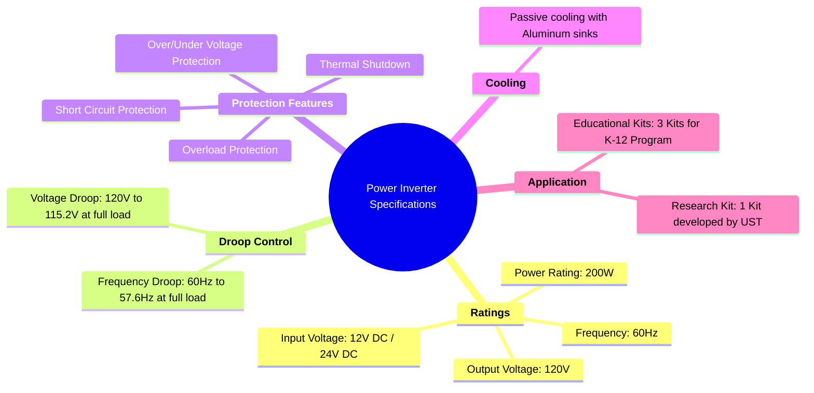

# **University of St. Thomas Specifications**
***

## Ratings
- Power Rating: 200W
- Output Voltage: 120V
- Input voltage: 12V DC/24V DC
- Frequency: 60Hz

## Droop Control
- Frequency Droop: 60Hz to 57.6 Hz at full load
- Voltage Droop: 120V – 115.2V at full load

## Protection Features
- Overload Protection
- Short Circuit Protection
- Over/Under Voltage Protection
- Thermal Shutdown

## Cooling
- Passive cooling with Aluminum sinks

## Application
- 3 Educational kits for k-12 program enclosed in a shield/box with access to inputs, outputs, and Arduino port
- 1 Research kit that will be developed by UST

