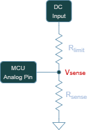
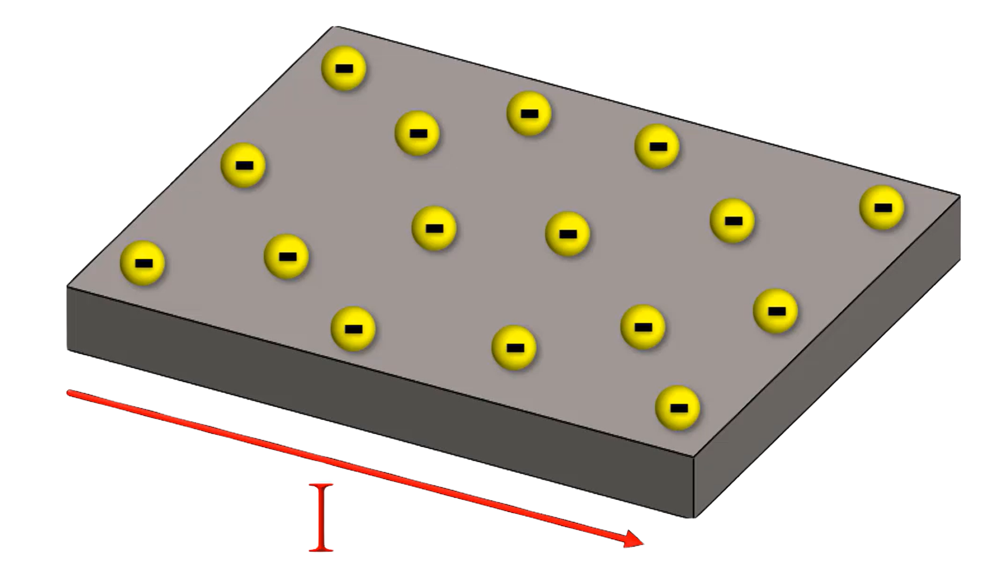
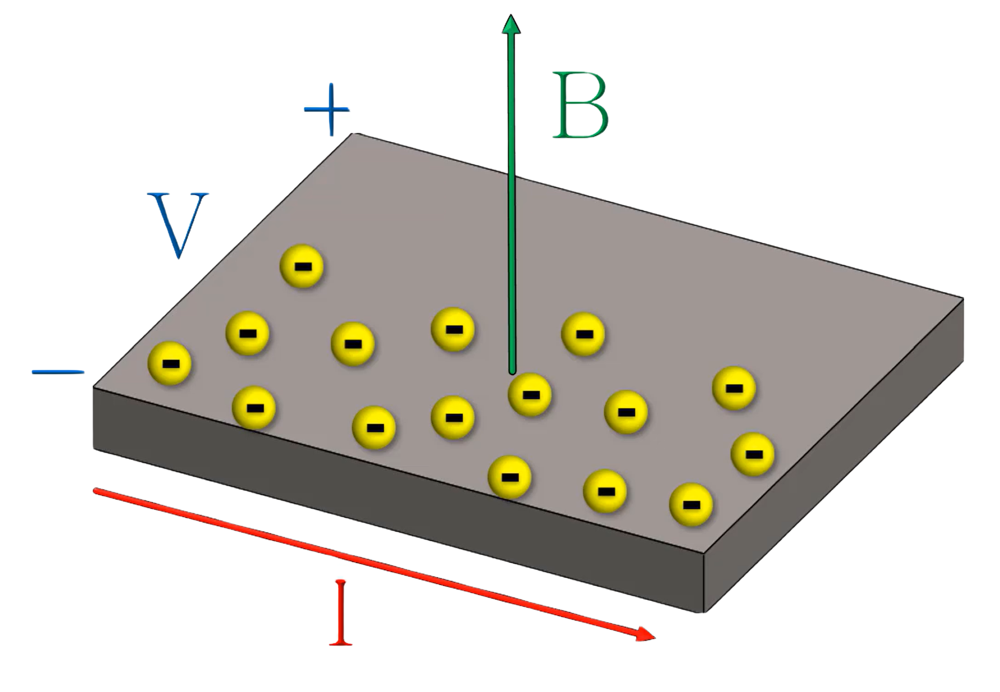
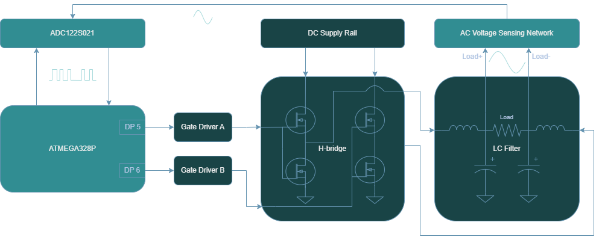
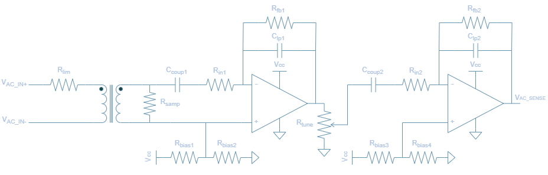
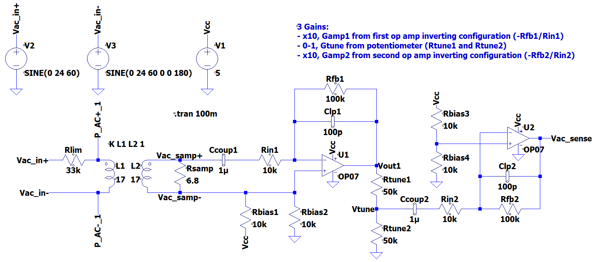
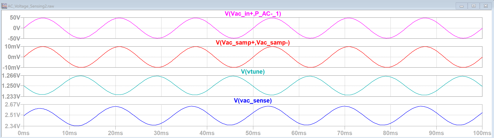
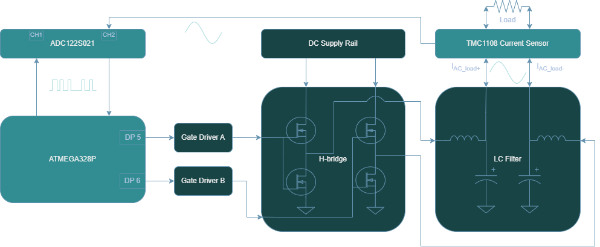

<!-- To enable math equation formatting -->

  <!-- Polyfill for older browsers (optional) -->
  

  <!-- MathJax v3 for LaTeX rendering -->
  

  <!-- Custom MathJax Configuration -->
  


# **Atinverter V2 Hardware**
***

The **Atinverter Version 2 (V2)** incorporates a multitude of subsystems that work in tandem to support the board's main function as a **power inverter**. A power inverter, not to be confused with a digital logic inverter, is a type of converter that takes a DC signal and transforms it to an AC signal. 

{: .highlight-yellow }
> 💭 "Why Atinverter?"

With the aim of highlighting the relationship between the ATMEGA328P MCU and the power inverter circuitry, the name is based on: "ATMEGA328P" + "Inverter" = "Atinverter"

To better visualize the core components and the interconnections of the design, consider the following the **high-level block diagram**: 

## **Systems**
To better understand the full scope of the Atinverter V2, it's helpful to explore the following systems in more detail.

- 🔌 Power Inverter
- 💡 LED Blinking for Bootloader Verification
- 📟 DC Voltage Sensing
- 📟 DC Current Sensing
- 📟 AC Voltage Sensing
- 📟 AC Current Sensing
- 🔁 ATMEGA328P & Raspberry Pi I²C Communication

{: .highlight-green }
🔌 Power Inverter

### 〰️ PWM Generation
The power inverter operation is catalyzed by the **PWM generation** from the **ATMEGA328P**. This MCU generates **pulse-width modulated (PWM) square waves** that, when combined with an appropriate switching circuit and filtering stage, can approximate the output of a **pure sine wave power inverter.** 

While there are other simpler approaches that can be employed to achieve inversion, such as square wave or modified square wave inverters, this one achieves **higher levels of waveform fidelity**. In other words, this modulation technique allows our output waveform to behave and appear more like a **real sine wave.**

Source: [Different Types of AC signals Produced by Inverters](https://www.e-education.psu.edu/eme812/node/711)

### 🧠 Gate Drivers
The next stage in the power signal chain is the gate driver circuit. It performs two main tasks:
1. Effectively level shifts the low voltage PWM signals from the ATMEGA328P into higher voltages required by the H-bridge circuit.
2. Enhance the current delivery to the power transistors to swiftly charge and discharge the gate capacitance of the transistors to ensure rapid switching of the devices.

### 🔁 H-Bridge Topology
Being composed of **4 power transistors** that complimentarily **switch at a specific frequency**, the H-bridge topology is a conventional design that is widely implemented in many pure sine wave inverters. This design **enables the connected load to experience a positive and negative voltage swing** solely based on switching states, effectively eliminating the need for a negative supply rail. This dual-polarity effect is what allows for the production of a full AC swing across the load and is achieved by PWM control signals as well as only one DC supply. 

### 🔉 LC Filter
Prior to the delivering the power to the load, a low pass filter stage is employed to:
1. Remove high frequency content, especially the switching frequency of the PWM signals.
2. Preserve the fundamental frequency of interest. In our case, our PWM-based inverter is designed for 50 or 60Hz.

### 🧩 Power Inverter Summary
After providing an overview of each of the power inverter stages, from PWM generation to filtering, consider the diagram below illustrating the signal chain:

To clarify subtle details about the diagram, DP5 and DP6 represent the digital pins 5 and 6 respectively. Also, two gate drivers were implemented into the design since each controls one pair of transistors.

{: .highlight-green }
💡 LED Blinking for Bootloader Verification

The LED circuit is effectively **four LEDs** that are independently controlled using **four different GPIO pins** of the ATMEGA328P. 

These LEDs are cycled on and off using a blink program providing a trivial aesthetic effect, but its primary purpose is a **functional verfication** of ATMEGA328P. Using a visual indictator allows us to determine if the MCU is bootloaded, which is a necessary step when working with a **brand-new chip**.

{: .highlight-green }
📟 DC Voltage Sensing

Voltage sensing of the DC input ($V_{DC}$) is achieved through a simple resistive divider. The resistive divider is made up of a limiting current resistor ($R_{limit}$) paired with a sensing resistor ($R_{sense}$). The voltage across the sensing resistance is measured by an ATMEGA328P analog pin which senses a voltage in the range of 0-5V ($V_{sense}$). It should be noted that the ATMEGA328P I/O pins cannot exceed 5V, as doing so may result in permanent damage to the MCU.

Resistors values are chosen based on this condition as well as drawing an insignificant amount of power from the DC input, since the current in this path is to be delivered primarily to the output load. 

The resistor values of $R_{limit} = 120k\Omega$ and $R_{sense} = 10k\Omega$ were chosen based on the standard voltage divider equation:

$$V_{sense} = V_{DC} \times \left( \frac{R_{sense}}{R_{sense}\times R_{limit}} \right)$$

Given that the nominal DC input range is 12V to 48V, this translates to a sensed voltage as low as 0.92V and a high as 3.69V. It is evident that the full scale range of the analog pin is not used (0-5V), but this is intentional to account for potential overvoltage driving at the DC pin. Nonetheless, the 10 bit analog to digital converter (ADC) of the ATMEGA328P works as necessary in detecting the DC voltage based on the design parameters selected.

{: .highlight-green }
📟 DC Current Sensing

The current in the DC input line is measured using a Hall-effect current sensor. Let's briefly cover how this type of device operates.

### Hall-Effect Current Sensor Overview

To understand hall-effect current sensors, we need to consider two fundamental laws of electromagnetism:
1. Lorentz Force Law
2. Ampere's Law

Rather than just explaining what the laws mean, let's understand how they manifest themselves in the operation of the device.

Consider a conductive element where a current flows. The yellow balls represent electrons that are evenly distributed when flowing through a conductor. The current flow is denoted as "I".

Ampere's law tells us that a magnetic field is generated around the conductor in accordance with the right-hand rule and that magnetic field is proportional to the current that is flowing. Additionally, if an external magnetic field is applied near the conductor (strongest when perpendicular due to Lorentz force), the electrons will be deflected and accumulate in one area leaving the opposite side with a net positive charge. The charge separation between both ends can be measured — known as the hall-voltage.

### TMCS1108

In this design, the **TMCS1108 current sensor** detects the magnetic field generated by the DC input current. It internally measures the hall-voltage and then amplifies it to produce an **analog voltage output which is proportional to the sensed current**. This analog voltage can be calculated using the [TMCS1108 datasheet](https://www.ti.com/lit/ds/symlink/tmcs1108.pdf?HQS=dis-dk-null-digikeymode-dsf-pf-null-wwe&ts=1744785799224) provided equation in page 12:

$$V_{OUT} = S \times I_{IN} + V_{OUT,0A}$$

where:
- $V_{OUT}$ is the analog output voltage. 
- S is the ideal sensitivity of the device. 
- $I_{IN}$ is the isolated input current. 
- $V_{OUT,0A}$ is the zero current output voltage for the device variant.

As this design employs the **TMCS1108A4BQDR** device variant, this features a sensitivity is 400mV/A. This describes the relation between the output analog voltage and current input where the output changes 400mV for every 1A of detected current. Higher sensitivities are generally favorable, as they results in a greater voltage response per unit of current.

The non-zero current output is due to the device bidirectionality of the sensor, where the output is centered at mid-supply as noted in page 3 of the [TMCS1108 datasheet](https://www.ti.com/lit/ds/symlink/tmcs1108.pdf?HQS=dis-dk-null-digikeymode-dsf-pf-null-wwe&ts=1744785799224).

$$V_{OUT,0A} = 0.5 × V_{S}$$

where:
- $V_{OUT,0A}$ is the zero current output voltage for the device variant.
- $V_{S}$ is the supply voltage to the chip.

Since the chip is powered by a 5V supply, at no current input, the output analog voltage resides at 2.5V. For positive current, the output voltage increases above 2.5V and conversesly for negative current, the output decreases below 2.5V.

The analog output voltage is then measured by the analog pin of our ATMEGA328P, where it is converted to a digital value between the range of 0-1023. After the MCU has an understanding of what the voltage signal is in the digital domain, the current for the DC input is computed using a restructured form of the previous equation.

$$I_{IN} = \frac{V_{OUT} - V_{OUT,0A}}{S}$$

This conversion ultimately produces an accurate current reading based on the previously discussed hall-effect phenomenon and fulfills the goal of measuring the DC input current of the Atinverter V2 device.

{: .highlight-green }
📟 AC Voltage Sensing

To achieve the sensing of the AC voltage at the output of the power inverter, the approach is more involved than the DC voltage sensing methodology described earlier. Not only does a step down mechanism need to be implemented to provide a low power sensed signal to a processing device, but also a method to handle or correct for the the bipolar nature of the AC wave, namely the negative swing. More specifically, the AC voltage sensing network needs to be able to scale a 12V-48Vpk signal to 0-5V signal in order to be compatible with the ADC122S021, which is used for output voltage and current sampling. The ADC122S021 serves as the intermediary between the ATMEGA328P and the AC sensed signal. It samples the output produced by the AC voltage sensing network and transmits the data to the ATMEGA328P via SPI communication. The ATMEGA328P receives the sensed data by requesting channel 1 of the ADC122S021 and uses it to compute the RMS reading of the voltage.

This section covers the hardware implementation for the AC sensing framework as illustrated above. To learn more about how the voltage RMS computation is performed and other key considerations for the software design, see the section [AC Voltage Sensing](../software/modules/ac_voltage_sensing).

## **AC Voltage Sensing Network**

The design is comprised of two main stages:
1. **ZMPT101B Transformer**
- Voltage step-down using 1:1 isolation transformer
- Well known and documented for projects that interface with Arduino/ESP/RaspberryPi devices
2. **Signal Conditioning and Amplification**
- A cascaded pair of inverting op-amp configurations to amplify the low-voltage sensed signal
- Tunable gain set by a potentiometer that aims to reduce potential saturation or improve resolution at AC sensing output
- Active low-pass filter attenuates high frequecy noise and improve signal integrity

### ZMPT101B Transformer

The first stage is based on the ZMPT101B current transformer. It is a 1:1, 1000V, 2mA rated transformer. For a more thorough documentation of the component, please review the [ZMPT101B datasheet](https://5nrorwxhmqqijik.leadongcdn.com/attachment/kjilKBmoioSRqlkqjoipSR7ww7fgzb73m/ZMPT101B-specification.pdf).

The input to output voltage relation describing the transformer operation is stated in ***Figure II***:

$$U_{2} = \frac{U_{1}}{R'} \times R$$

where:
- $U_1$ is the input voltage
- $U_2$ is the output voltage
- $R'$ is the current limiting resistor
- $R$ is the voltage sampling resistor

In efforts to maintain consistency with the previous AC Voltage Circuit diagram, we will denote $U_1$, $U_2$, $R'$, $R$ as $V_{\mathrm{AC\_in}}$, $V_{\mathrm{AC\_samp}}$, $R_{lim}$, $R_{samp}$ respectively. Therefore, the newly denoted equation is

$$V_{\mathrm{AC_samp}} = \frac{V_{\mathrm{AC_in}}}{R_{lim}} \times R_{samp}$$

### 🔢 Calculating $R_{lim}$

To achieve higher levels of Signal-to-Noise Ratio (SNR), better ADC range, and noise immunity, a current limiting resistor $R_{lim}$ should be selected such that the magnitude is near the rated current but not exceeding. Choosing a current limiting resistor is based on the highest expected voltage that will be delivered to the input primary side of the transformer. Recalling that the maximum peak voltage for the power inverter is 48V, and considering that the transformer has a rated current of 2mA, a max current value of 1.5mA is chosen. This ensures that $V_{\mathrm{AC\_in}}$ is maximized in signal strength to improve resolution, but also provides buffer from operating the part at rated conditions. 

$$R_{lim} = \frac{V_{\mathrm{AC_in}}}{I_{\mathrm{AC_in}}}$$

$$R_{lim} = \frac{48V}{1.5mA} = 32k\Omega$$

- Choose $33k\Omega$ based on standard resistor values

### 🔢 Calculating $R_{samp}$

The sampling resistance linearly influences the transformer AC voltage output as per the equation in ***Figure II***. By rearragning the ZMPT101B expression, this renders the following equation usable for solving the sampling resistor in a passive configuration where no amplication is present.

$$V_{\mathrm{AC_samp}} = \frac{V_{\mathrm{AC_in}}}{R_{lim}} \times R_{samp}$$

$$R_{samp} = \frac{V_{\mathrm{AC_samp}}}{V_{\mathrm{AC_in}}} \times R_{lim}$$

However, this expression is not directly applicable since it makes use of an active configuration. Nonetheless, it can be adapted to suit the needs of the current design as detailed in the next section.

### Signal Conditioning and Amplification

The second stage of the **AC Voltage Sensing Network** is a combination of two inverting amplication phases that serve the purpose of amplifying the low voltage signal produced across the sampling resistor. Each level provides an amplication factor of 10, yielding a net gain of 100. To develop a transfer function that accounts for this two op-amp amplification chain in the AC voltage sensing network, this gain stage can be modeled by a variable $G_{amp}$. This net gain is also equivalent to the product of the two intermediate gains $G_{1} \times G_{2}$.

The AC voltage from output to input then can be described as:

$$V_{\mathrm{ACsense}} = G_{amp} \times \frac{V_{\mathrm{AC_in}}}{R_{lim}} \times R_{samp}$$

It is important to note that $V_{\mathrm{ACsense}}$ refers to the desired AC magnitude that will be provided to the ADC122S021 after the two op amp chain whereas $V_{\mathrm{ACsamp}}$ is the AC magnitude at the secondary of the transformer.

The amplification phases are also designed to attenuate high frequency noise, as they are based on the active low pass filter topology. This is necessary because although the output of the transformer is being amplified in two segments, the noise present at the op-amp inputs can also amplified. It is beneficial to have this embedded into the design since $V_{\mathrm{ACsense}}$ needs to be a clean waveform for accurate readings from the ADC122S021.

The cutoff frequency of this 1st order low-pass filter can be calculated using the following formula:

$$f_{c} = \frac{1}{2\pi \times C_{lp} \times R_{fb}}$$

Another key feature of the AC Voltage Sensing Network is the potentiometer, $R_{tune}$ as it also impacts the magnitude of $V_{\mathrm{ACsense}}$. Since the potentiometer functions as a voltage divider, it can be modeled by introducing two resistors: $R_{tune1}$, the resistor in series with the signal path, and $R_{tune2}$, the resistor connected to ground. Therefore, the divider ratio is:

$$G_{tune} = \frac{R_{tune1}}{R_{tune1}+ R_{tune2}}$$

Since the divider ratio is effectively a gain constant between the first and second op amp chain, both of which are linearly combined, the specific placement of this term has no effect on the $V_{\mathrm{ACsense}}$ computation.  

$$V_{\mathrm{ACsense}} = G_{amp} \times \frac{V_{\mathrm{AC_in}}}{R_{lim}} \times R_{samp} \times G_{tune}$$

To obtain the final sampling resistor equation that, we can isolate for the sampling resistor:

$$R_{samp} = \frac{V_{\mathrm{ACsense}}}{V_{\mathrm{AC_in}} \times G_{amp} \times G_{tune}} \times R_{lim}$$

The AC portion of the $V_{\mathrm{ACsense}}$ signal must remain within the saturation limits of the LM358 op-amp due to resulting amplified signal being centered around a 2.5V DC offset, which is caused by the $R_{bias}$ resistors.

Since the LM358 op amp saturates at about 1.5V from the supply voltage (i.e. 5V - 1.5V = 3.5V), then the maximum permissible swing is $V_{\mathrm{ACsense}} = 1V_{pk}$. 

The worst case scenario for potential saturation occurs when the potentiometer provides no gain attenuation (i.e $G_{tune} = 1$), resulting in an amplification of $G_{amp}$ = 100 applied to $V_{\mathrm{ACsamp}}$. Using this case to calculate the sampling resistor is performed for both ends of the inverter range.

**$$V_{\mathrm{AC_in}}$$ = 12V:**

$$R_{samp} = \frac{1}{12 \times 100 \times 1} \times 33k = 27.5\Omega$$

**$$V_{\mathrm{AC_in}}$$ = 48V:**

$$R_{samp} = \frac{1}{48 \times 100 \times 1} \times 33k = 6.87\Omega$$

- Choose $6.8\Omega$ based on standard resistor values, as this accomodates for both 12V and 48V $V_{\mathrm{AC_in}}$. The effective resolution of the sensed signal can then be improved by reducing $R_{tune}$, as this increases the output swing without exceeding the op-amp’s output swing range.

### Simulation

The AC voltage sensing topology was simulated using LTSpice to verify operation. Since the LM358 is not an available in the component library, the OP07 amplifier was used as a suitable substitute. 

{: .highlight-green }
📟 AC Current Sensing

Sensing the current from the AC load is similarly achieved to sensing the DC input. On the AC side, the TMCS1108 hall-effect current sensor is likewise employed. What differs is how the signal is analyzed after being sampled by current sensor. In this case, the output analog voltage that maps to the load current is not being delivered directly to ATMEGA328P for processing and calculation, but rather to the second input channel of the ADC122S021.

To gain more insight into how the algorithm for computing the AC load current is performed using the ADC122S021 sampling, please refer to the section on [AC Current Sensing](../software/modules/ac_current_sensing).

{: .highlight-green }
🔁 ATMEGA328P & Raspberry Pi I2C Communication

- **Will be documented once I2C bus is verified**