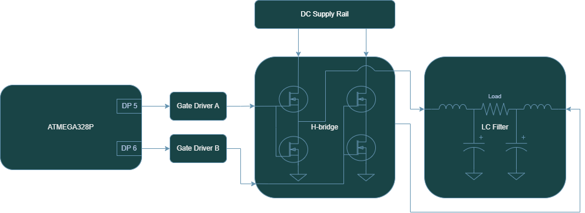

<!-- To enable math equation formatting -->

  <!-- Polyfill for older browsers (optional) -->
  

  <!-- MathJax v3 for LaTeX rendering -->
  

  <!-- Custom MathJax Configuration -->
  


# **Atinverter V2 Hardware**
***

The **Atinverter Version 2 (V2)** incorporates a multitude of subsystems that work in tandem to support the board's main function as a **power inverter**. A power inverter, not to be confused with a digital logic inverter, is a type of converter that takes a DC signal and transforms it to an AC signal. 

{: .highlight-yellow }
> 💭 "Why Atinverter?"

With the aim of highlighting the relationship between the ATMEGA328P MCU and the power inverter circuitry, the name is based on: "ATMEGA328P" + "Inverter" = "Atinverter"

To better visualize the core components and the interconnections of the design, consider the following the **high-level block diagram**: 

## Subsystems
To better understand the full scope of the Atinverter V2, it's helpful to explore the following subsystems in more detail.

- 🔌 Power Inverter
- 💡 LED Blinking for Bootloader Verification
- 📟 DC Voltage Sensing
- 📟 DC Current Sensing
- 📟 AC Voltage Sensing
- 📟 AC Current Sensing
- 🔁 ATMEGA328P & Raspberry Pi I²C Communication

{: .highlight-green }
🔌 Power Inverter

### 〰️ PWM Generation
The power inverter operation is catalyzed by the **PWM generation** from the **ATMEGA328P**. This MCU generates **pulse-width modulated (PWM) square waves** that, when combined with an appropriate switching circuit and filtering stage, can approximate the output of a **pure sine wave power inverter.** 

While there are other simpler approaches that can be employed to achieve inversion, such as square wave or modified square wave inverters, this one achieves **higher levels of waveform fidelity**. In other words, this modulation technique allows our output waveform to behave and appear more like a **real sine wave.**

Source: [Different Types of AC signals Produced by Inverters](https://www.e-education.psu.edu/eme812/node/711)

### 🧠 Gate Drivers
The next stage in the power signal chain is the gate driver circuit. It performs two main tasks:
1. Effectively level shifts the low voltage PWM signals from the ATMEGA328P into higher voltages required by the H-bridge circuit.
2. Enhance the current delivery to the power transistors to swiftly charge and discharge the gate capacitance of the transistors to ensure rapid switching of the devices.

### 🔁 H-Bridge Topology
Being composed of **4 power transistors** that complimentarily **switch at a specific frequency**, the H-bridge topology is a conventional design that is widely implemented in many pure sine wave inverters. This design **enables the connected load to experience a positive and negative voltage swing** solely based on switching states, effectively eliminating the need for a negative supply rail. This dual-polarity effect is what allows for the production of a full AC swing across the load and is achieved by PWM control signals as well as only one DC supply. 

### 🔉 LC Filter
Prior to the delivering the power to the load, a low pass filter stage is employed to:
1. Remove high frequency content, especially the switching frequency of the PWM signals.
2. Preserve the fundamental frequency of interest. In our case, our PWM-based inverter is designed for 50 or 60Hz.

### 🧩 Power Inverter Summary
After providing an overview of each of the power inverter stages, from PWM generation to filtering, consider the diagram below illustrating the signal chain:

To clarify subtle details about the diagram, DP5 and DP6 represent the digital pins 5 and 6 respectively. Also, two gate drivers were implemented into the design since each controls one pair of transistors.

{: .highlight-green }
💡 LED Blinking for Bootloader Verification

The LED circuit is effectively **four LEDs** that are independently controlled using **four different GPIO pins** of the ATMEGA328P. 

These LEDs are cycled on and off using a blink program providing a trivial aesthetic effect, but its primary purpose is a **functional verfication** of ATMEGA328P. Using a visual indictator allows us to determine if the MCU is bootloaded, which is a necessary step when working with a **brand-new chip**.

{: .highlight-green }
📟 DC Voltage Sensing

Voltage sensing of the DC input ($V_{DC}$) is achieved through a simple resistive divider. The resistive divider is made up of a limiting current resistor ($R_{limit}$) paired with a sensing resistor ($R_{sense}$). The voltage across the sensing resistance is measured by an ATMEGA328P analog pin which senses a voltage in the range of 0-5V ($V_{sense}$). It should be noted that the ATMEGA328P I/O pins cannot exceed 5V, as doing so may result in permanent damage to the MCU.

Resistors values are chosen based on this condition as well as drawing an insignificant amount of power from the DC input, since the current in this path is to be delivered primarily to the output load. 

The resistor values of $R_{limit} = 120k\Omega$ and $R_{sense} = 10k\Omega$ were chosen based on the standard voltage divider equation:

$$V_{sense} = V_{DC} \times \left( \frac{R_{sense}}{R_{sense}\times R_{limit}} \right)$$

Given that the nominal DC input range is 12V to 48V, this translates to a sensed voltage as low as 0.92V and a high as 3.69V. It is evident that the full scale range of the analog pin is not used (0-5V), but this is intentional to account for potential overvoltage driving at the DC pin. Nonetheless, the 10 bit analog to digital converter (ADC) of the ATMEGA328P works as necessary in detecting the DC voltage based on the design parameters selected.

{: .highlight-green }
📟 DC Current Sensing

The current in the DC input line is measured using a Hall-effect current sensor. Let's briefly cover how this type of device operates.

### Hall-Effect Current Sensor Overview

To understand hall-effect current sensors, we need to consider two fundamental laws of electromagnetism:
1. Lorentz Force Law
2. Ampere's Law

Rather than just explaining what the laws mean, let's understand how they manifest themselves in the operation of the device.

Consider a conductive element where a current flows. The yellow balls represent electrons that are evenly distributed when flowing through a conductor. The current flow is denoted as "I".

Ampere's law tells us that a magnetic field is generated around the conductor in accordance with the right-hand rule and that magnetic field is proportional to the current that is flowing. Additionally, if an external magnetic field is applied near the conductor (strongest when perpendicular due to Lorentz force), the electrons will be deflected and accumulate in one area leaving the opposite side with a net positive charge. The charge separation between both ends can be measured — known as the hall-voltage.

### TMCS1108

In this design, the **TMCS1108 current sensor** detects the magnetic field generated by the DC input current. It internally measures the hall-voltage and then amplifies it to produce an **analog voltage output which is proportional to the sensed current**. This analog voltage can be calculated using the [TMCS1108 datasheet](https://www.ti.com/lit/ds/symlink/tmcs1108.pdf?HQS=dis-dk-null-digikeymode-dsf-pf-null-wwe&ts=1744785799224) provided equation in page 12:

$$V_{OUT} = S \times I_{IN} + V_{OUT,0A}$$

where:
- $V_{OUT}$ is the analog output voltage. 
- S is the ideal sensitivity of the device. 
- $I_{IN}$ is the isolated input current. 
- $V_{OUT,0A}$ is the zero current output voltage for the device variant.

As this design employs the **TMCS1108A4BQDR** device variant, this features a sensitivity is 400mV/A. This describes the relation between the output analog voltage and current input where the output changes 400mV for every 1A of detected current. Higher sensitivities are generally favorable, as they results in a greater voltage response per unit of current.

The non-zero current output is due to the device bidirectionality of the sensor, where the output is centered at mid-supply as noted in page 3 of the [TMCS1108 datasheet](https://www.ti.com/lit/ds/symlink/tmcs1108.pdf?HQS=dis-dk-null-digikeymode-dsf-pf-null-wwe&ts=1744785799224).

$$V_{OUT,0A} = 0.5 × V_{S}$$

where:
- $V_{OUT,0A}$ is the zero current output voltage for the device variant.
- $V_{S}$ is the supply voltage to the chip.

Since the chip is powered by a 5V supply, at no current input, the output analog voltage resides at 2.5V. For positive current, the output voltage increases above 2.5V and conversesly for negative current, the output decreases below 2.5V.

The analog output voltage is then measured by the analog pin of our ATMEGA328P, where it is converted to a digital value between the range of 0-1023. After the MCU has an understanding of what the voltage signal is in the digital domain, the current for the DC input is computed using a restructured form of the previous equation.

$$I_{IN} = \frac{V_{OUT} - V_{OUT,0A}}{S}$$

This conversion ultimately produces an accurate current reading based on the previously discussed hall-effect phenomenon and fulfills the goal of measuring the DC input current of the Atinverter V2 device.

{: .highlight-green }
📟 AC Voltage Sensing

To achieve the sensing of the AC voltage at the output of the Atinverter V2, the approach is more involved compared to the DC voltage sensing methodology described earlier. As it is expected that the AC output voltage range is between 12V-48V just like the DC side, the key challenge is the bipolar nature of the AC wave, namely the negative swing as well as the high voltage level. 

This poses a conflict for the analog to digital (ADC) converter utilized for this design, due to the following two characteristics:

1. **Single-ended:** measures signals at input pins relative to ground, Vmeasured = Vin - GND
2. **Unipolar:** measures positive signals, 0 to VREF

The output waveform of the **power inverter** is purely an AC signal with no DC offset. Additionally, the amplitude is based directly the DC input. This implies that the output voltage of the power inverter is violating the allowable voltage range of the ADC, not only from a magnitude standpoint, but also in polarity.

### AC Voltage Ciruit

{: .highlight-green }
📟 AC Current Sensing

{: .highlight-green }
🔁 ATMEGA328P & Raspberry Pi I2C Communication