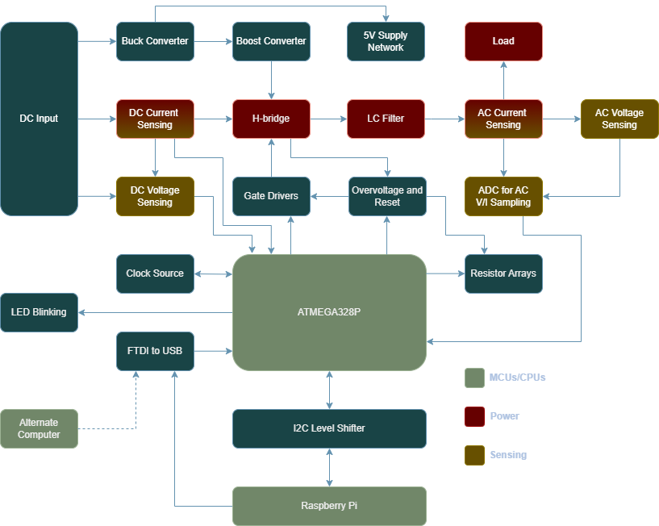
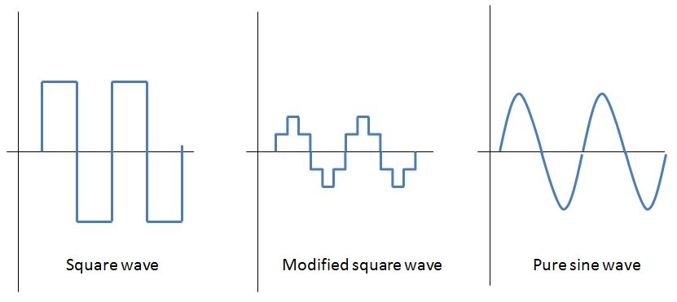
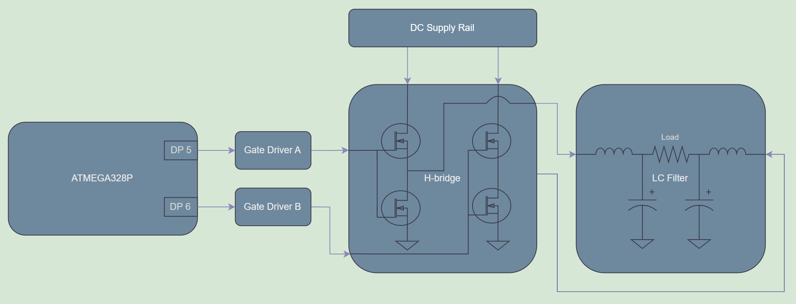
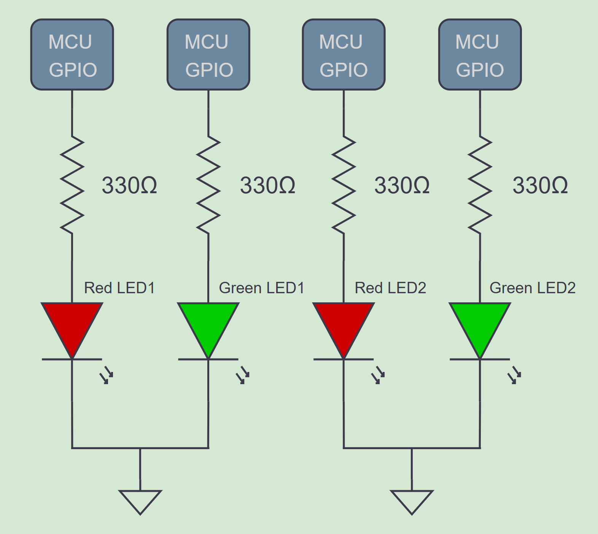

# **Atinverter V2 Hardware**
***

The **Atinverter Version 2 (V2)** is composed of a multitude of subsystems that work in tandem to support the board's main function as a **power inverter**. A power inverter, not to be confused with a digital logic inverter, is a type of converter that takes a DC signal and transforms it to an AC signal. 

{: .highlight-yellow }
> 💭 "Why Atinverter?"

With the aim of highlighting the relationship between the ATMEGA328P MCU and the power inverter circuitry, the name is based on: "ATMEGA328P" + "Inverter" = "Atinverter"

To better visualize the core components and the interconnections of the design, consider the following the **high-level block diagram**: 

## Subsystems and Extra Circuits 
To better understand the full scope of the Atinverter V2, it's helpful to explore the following subsystems in more detail.

- 🔌 Power Inverter
- 💡 LED Blinking
- 📉 DC Voltage and Current Sensing
- 📈 AC Voltage and Current Sensing
- 🔁 ATMEGA328P & Raspberry Pi I²C Communication

{: .highlight-green }
🔌 Power Inverter

### 〰️ PWM Generation
The power inverter operation is catalyzed by the **PWM generation** from the **ATMEGA328P**. This MCU generates **pulse-width modulated (PWM) square waves** that, when combined with an appropriate switching circuit and filtering stage, can approximate the output of a **pure sine wave power inverter.** 

While there are other simpler approaches that can be employed to achieve inversion, such as square wave or modified square wave inverters, this one achieves higher levels of waveform fidelity. In other words, this modulation technique allows our output waveform to behave and appear more like a real sine wave.

Source: [Different Types of AC signals Produced by Inverters](https://www.e-education.psu.edu/eme812/node/711)

### 🧠 Gate Drivers
The next stage in the power signal chain is the gate driver circuit. It performs two main tasks:
1. Effectively level shifts the low voltage PWM signals from the ATMEGA328P into higher voltages required by the H-bridge circuit.
2. Enhance the current delivery to the power transistors to swiftly charge and discharge the gate capacitance of the transistors to ensure rapid switching of the devices.

### 🔁 H-Bridge Topology
Being composed of **4 power transistors** that complimentarily **switch at a specific frequency**, the H-bridge topology is a conventional design that is widely implemented in many pure sine wave inverters. This design **enables the connected load to experience a positive and negative voltage swing** solely based on switching states, effectively eliminating the need for a negative supply rail. This dual-polarity effect is what allows for the production of a full AC swing across the load and is achieved by PWM control signals as well as only one DC supply. 

### 🔉 LC Filter
Prior to the delivering the power to the load, a low pass filter stage is employed to:
1. Remove high frequency content, especially the switching frequency of the PWM signals.
2. Preserve the fundamental frequency of interest. In our case, our PWM-based inverter is designed for 50 or 60Hz.

### 🧩 Power Inverter Summary
After providing an overview of each of the power inverter stages, from PWM generation to filtering, consider the diagram below illustrating the signal chain:

To clarify subtle details about the diagram, DP5 and DP6 represent the digital pins 5 and 6 respectively. Also, two gate drivers were implemented into the design since each controls one pair of transistors.

{: .highlight-green }
💡 LED Blinking

The LED circuit is effectively **four LEDs** that are independently controlled using **four different GPIO pins** of the ATMEGA328P. 

These LEDs are cycled on and off using a blink program providing a trivial aesthetic effect, but its primary purpose is a **functional verfication** of ATMEGA328P. Using a visual indictator allows us to determine if the MCU is bootloaded, which is a necessary step when working with a **brand-new chip**.

