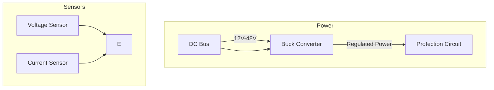

# **Atinverter V2 Hardware**
***

```mermaid
graph TD;
  subgraph Power
  A[DC Bus] --> |12V-48V| B[Buck Converter]
  A -->  
  B --> |Regulated Power| D[Protection Circuit]
  end
  
  subgraph Sensors
    G[Voltage Sensor] --> E
    H[Current Sensor] --> E
  end
```
