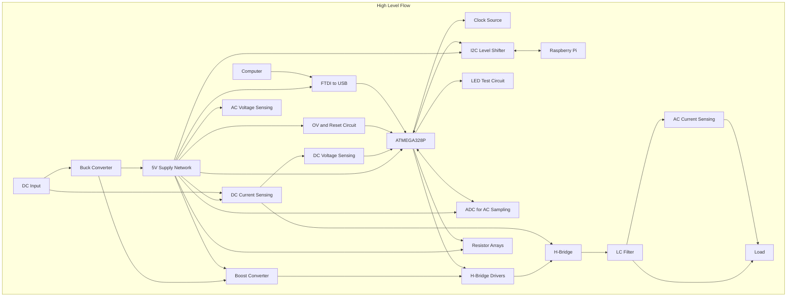
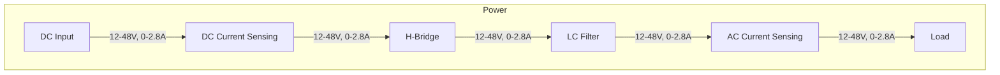
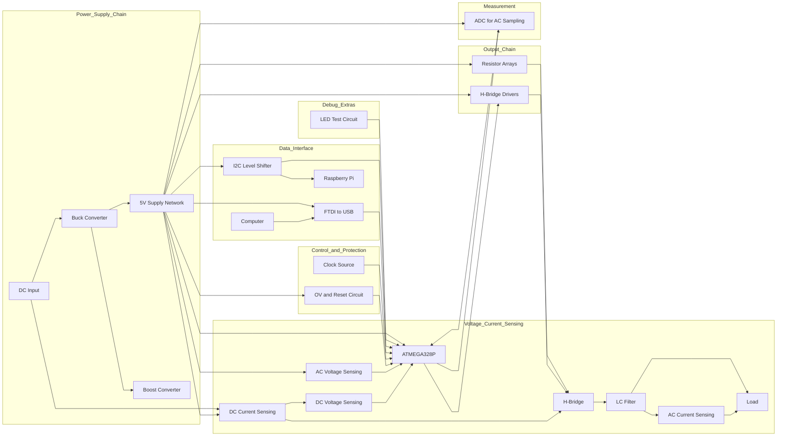
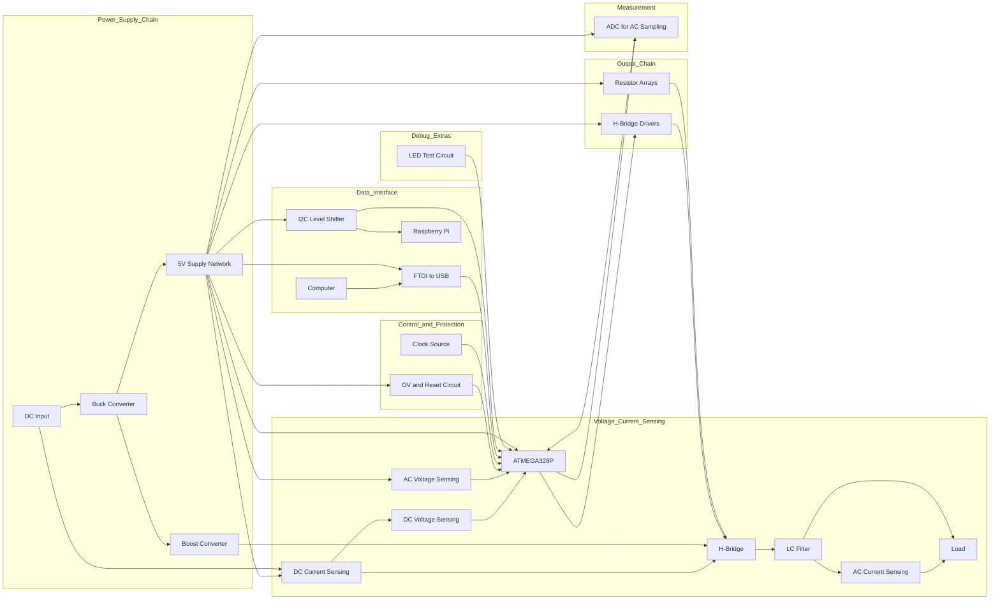

# **Atinverter V2 Hardware**
***

```mermaid
graph TD;
  subgraph High Level Flow
  A[ATMEGA328P]
  B[I2C Level Shifter]
  C[Raspberry Pi]
  D[DC Input]
  E[Buck Converter]
  F[DC Current Sensing]
  G[DC Voltage Sensing]
  H[H-Bridge]
  I[LC Filter]
  J[AC Current Sensing]
  K[AC Voltage Sensing]
  L[ADC for AC Sampling]
  M[Load]
  N[Boost Converter]
  O[H-Bridge Drivers]
  P[Clock Source]
  Q[5V Supply Network]
  R[OV and Reset Circuit]
  S[LED Test Circuit]
  T[FTDI to USB]
  U[Computer]
  V[Resistor Arrays]

  %% Computer to FTDI/USB
  U --> T

  %% FTDI/USB to ATMEGA328P
  T --> A

  %% ATMEGA328P to Clock Source
  A --> P

  %% ATMEGA328P to H-bridge Drivers
  A --> O

  %% OV and Reset Circuit to ATMEGA328P
  R --> A

  %% ATMEGA328P to LED Test Circuit
  A --> S

  %% ATMEGA328P to ADC for AC Sampling
  A <--> L

  %% ATMEGA328P to I2C Level Shifter
  A <--> B

  %% I2C Level Shifter to Rpi
  B <--> C

  %% DC Voltage Sensing to ATMEGA328P
  G --> A

  %% ATMEGA to Resistor Arrays
  A --> V

  %% DC Input to Buck Converter
  D --> E

  %% DC Input to DC Current Sensing
  D --> F

  %% Buck Converter to 5V Supply Network
  E --> Q

  %% 5V Supply Network to DC Current Sensing
  Q --> F

  %% 5V Supply Network to OV and Reset Circuit
  Q --> R

  %% 5V Supply Network to ADC for AC Sampling
  Q --> L

  %% 5V Supply Network to Boost Converter
  Q --> N

  %% 5V Supply Network to I2C Level Shifter
  Q --> B

  %% 5V Supply Network to AC Voltage Sensing
  Q --> K

  %% 5V Supply Network to AC Voltage Sensing
  Q --> T

  %% 5V Supply Network to ATMEGA328P
  Q --> A

  %% 5V Supply Network to Resistor Arrays
  Q --> V

  %% 12V Power Supply Connections
  N --> O

  %% DC Input to H-Bridge 
  F --> H

  %% H-Bridge to LC Filter
  H --> I

  %% DC Input to
  J --> M

  %% LC Filter to Load
  I --> M

  %% LC Filter to AC Current Sensing
  I --> J

  %% DC Current Sensing to DC Voltage Sensing
  F --> G

  %% Buck Converter to Boost Converter
  E --> N

  %% Gate Drivers to H-Bridge
  O --> H

  end
```
 

```mermaid
graph TD;
  subgraph Power
  D[DC Input]
  F[DC Current Sensing]
  H[H-Bridge]
  I[LC Filter]
  J[AC Current Sensing]
  M[Load]

  D --> |12-48V, 0-2.8A| F
  F --> |12-48V, 0-2.8A| H
  H --> |12-48V, 0-2.8A| I
  I --> |12-48V, 0-2.8A| J
  J --> |12-48V, 0-2.8A| M

  end
```

```mermaid
%%{ init: { "flowchart": { "curve": "linear", "nodeSpacing": 40, "rankSpacing": 40 } } }%%
graph LR
  %% Main Controller
  A[ATMEGA328P]

  %% Subgraphs
  subgraph Power_Supply_Chain
    D[DC Input] --> E[Buck Converter] --> Q[5V Supply Network]
    E --> N[Boost Converter]
  end

  subgraph Voltage_Current_Sensing
    F[DC Current Sensing] --> G[DC Voltage Sensing]
    Q --> F
    G --> A
    F --> H
    I --> J[AC Current Sensing]
    J --> M
    Q --> K[AC Voltage Sensing]
    K --> A
  end

  subgraph Control_and_Protection
    R[OV and Reset Circuit] --> A
    Q --> R
    P[Clock Source] --> A
  end

  subgraph Data_Interface
    U[Computer] --> T[FTDI to USB] --> A
    B[I2C Level Shifter] --> A
    B --> C[Raspberry Pi]
    Q --> B
  end

  subgraph Output_Chain
    O[H-Bridge Drivers] --> H[H-Bridge] --> I[LC Filter] --> M[Load]
    A --> O
    Q --> O
    Q --> V[Resistor Arrays]
    V --> H
  end

  subgraph Measurement
    L[ADC for AC Sampling] --> A
    Q --> L
    A --> L
  end

  subgraph Debug_Extras
    S[LED Test Circuit] --> A
  end

  %% Additional paths
  D --> F
  Q --> T
  Q --> A
```

```mermaid
%%{ init: { 
  "theme": "dark", 
  "themeVariables": {
    "edgeLabelBackground":"#1a1a1a",
    "fontFamily": "monospace",
    "fontSize": "14px",
    "lineColor": "#ffffff",        %% White arrows
    "edgeStrokeWidth": "2px",
    "primaryColor": "#282c34",     %% Node fill
    "primaryTextColor": "#ffffff", %% Node text
    "primaryBorderColor": "#999999"
  },
  "flowchart": { 
    "curve": "linear", 
    "nodeSpacing": 40, 
    "rankSpacing": 40 
  } 
} }%%
graph LR
  %% Main Controller
  A[ATMEGA328P]

  %% Subgraphs
  subgraph Power_Supply_Chain
    D[DC Input] --> E[Buck Converter] --> Q[5V Supply Network]
    E --> N[Boost Converter]
  end

  subgraph Voltage_Current_Sensing
    F[DC Current Sensing] --> G[DC Voltage Sensing]
    Q --> F
    G --> A
    F --> H
    I --> J[AC Current Sensing]
    J --> M
    Q --> K[AC Voltage Sensing]
    K --> A
  end

  subgraph Control_and_Protection
    R[OV and Reset Circuit] --> A
    Q --> R
    P[Clock Source] --> A
  end

  subgraph Data_Interface
    U[Computer] --> T[FTDI to USB] --> A
    B[I2C Level Shifter] --> A
    B --> C[Raspberry Pi]
    Q --> B
  end

  subgraph Output_Chain
    N --> H
    O[H-Bridge Drivers] --> H[H-Bridge] --> I[LC Filter] --> M[Load]
    A --> O
    Q --> O
    Q --> V[Resistor Arrays]
    V --> H
  end

  subgraph Measurement
    L[ADC for AC Sampling] --> A
    Q --> L
    A --> L
  end

  subgraph Debug_Extras
    S[LED Test Circuit] --> A
  end

  %% Additional paths
  D --> F
  Q --> T
  Q --> A
```
