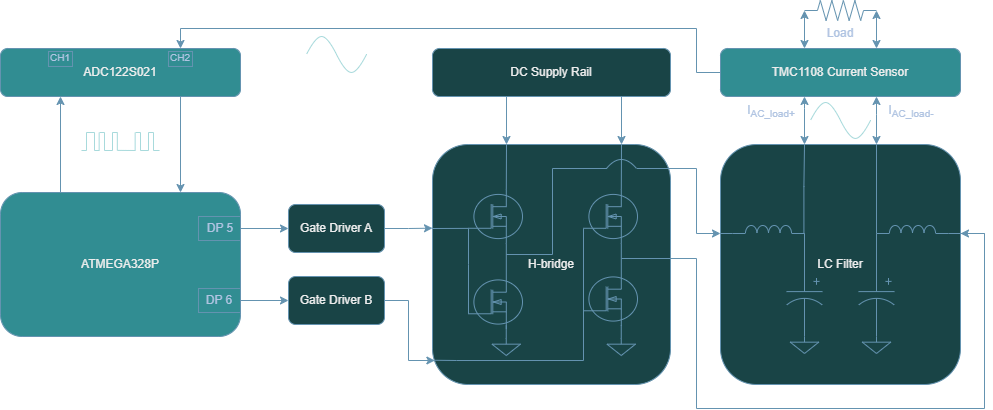

<!-- To enable math equation formatting -->

  <!-- Polyfill for older browsers (optional) -->
  

  <!-- MathJax v3 for LaTeX rendering -->
  

  <!-- Custom MathJax Configuration -->
  


# **AC Current Sensing Hardware**
---

Sensing the current from the AC load is similarly achieved to sensing the DC input. On the AC side, the TMCS1108 hall-effect current sensor is likewise employed. What differs is how the signal is analyzed after being sampled by current sensor. In this case, the output analog voltage that maps to the load current is not being delivered directly to ATMEGA328P for processing and calculation, but rather to the second input channel of the ADC122S021.

    <h7><b>Figure X.</b> AC Current Sensing Block Diagram </h7>

To gain more insight into how the algorithm for computing the AC load current is performed using the ADC122S021 sampling, please refer to the section on [AC Current Sensing](../software/modules/ac_current_sensing).