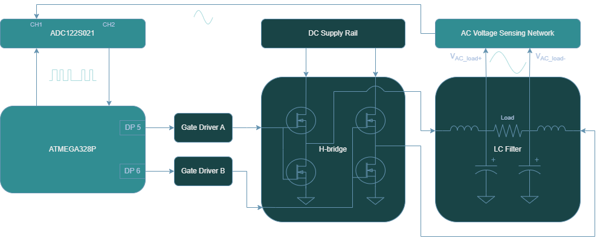

<!-- To enable math equation formatting -->

  <!-- Polyfill for older browsers (optional) -->
  

  <!-- MathJax v3 for LaTeX rendering -->
  

  <!-- Custom MathJax Configuration -->
  


# **AC Voltage Sensing Hardware**
---

To achieve the sensing of the AC voltage at the output of the power inverter, the approach is more involved than the DC voltage sensing methodology. Not only does a step down mechanism need to be implemented to provide a low power sensed signal to a processing device, but also a method to handle or correct for the the bipolar nature of the AC wave, namely the negative swing. More specifically, the AC voltage sensing network needs to be able to scale a 24V - $96V_{pkpk}$ signal to 0-5V signal in order to be compatible with the ADC122S021, which is used for output voltage and current sampling. The ADC122S021 serves as the intermediary between the ATMEGA328P and the AC sensed signal. It samples the output produced by the AC voltage sensing network and transmits the data to the ATMEGA328P via SPI communication. The ATMEGA328P receives the sensed data by requesting channel 1 of the ADC122S021 and uses it to compute the RMS reading of the voltage.

    <h7><b>Figure X.</b> AC Voltage Sensing Block Diagram </h7>

This section covers the hardware implementation for the AC sensing framework as illustrated above. To learn more about how the voltage RMS computation is performed and other key considerations for the software design, see the section [AC V/I Sensing Library Feature](../../software/library/features/ac_vi_sensing_feature).

## **AC Voltage Sensing Network**

    <h7><b>Figure X.</b> AC Voltage Sensing Network </h7>

The design is comprised of two main stages:
1. **ZMPT101B Transformer**
- Voltage step-down using 1:1 isolation transformer
- Well known and documented for projects that interface with Arduino/ESP/RaspberryPi devices
2. **Signal Conditioning and Amplification**
- A cascaded pair of inverting op-amp configurations to amplify the low-voltage sensed signal
- Tunable gain set by a potentiometer that aims to reduce potential saturation or improve resolution at AC sensing output
- Active low-pass filter attenuates high frequecy noise and improve signal integrity

## ZMPT101B Transformer

The first stage is based on the ZMPT101B current transformer. It is a 1:1, 1000V, 2mA rated transformer. For a more thorough documentation of the component, please review the [ZMPT101B datasheet](https://5nrorwxhmqqijik.leadongcdn.com/attachment/kjilKBmoioSRqlkqjoipSR7ww7fgzb73m/ZMPT101B-specification.pdf).

The input to output voltage relation describing the transformer operation is stated in ***Figure II*** of the datasheet:

$$U_{2} = \frac{U_{1}}{R'} \times R$$

where:
- $U_1$ is the input voltage
- $U_2$ is the output voltage
- $R'$ is the current limiting resistor
- $R$ is the voltage sampling resistor

In efforts to maintain consistency with the previous AC Voltage Circuit diagram, we will denote $U_1$, $U_2$, $R'$, $R$ as $V_{\mathrm{AC\_in}}$, $V_{\mathrm{AC\_samp}}$, $R_{lim}$, $R_{samp}$ respectively. Therefore, the newly denoted equation is

$$V_{\mathrm{AC_samp}} = \frac{V_{\mathrm{AC_in}}}{R_{lim}} \times R_{samp}$$

## 🔢 Calculating $R_{lim}$

To achieve higher levels of Signal-to-Noise Ratio (SNR), better ADC range, and noise immunity, a current limiting resistor $R_{lim}$ should be selected such that the magnitude is near the rated current but not exceeding. Choosing a current limiting resistor is based on the highest expected voltage that will be delivered to the input primary side of the transformer. Recalling that the maximum peak voltage for the power inverter is 48V, and considering that the transformer has a rated current of 2mA, a max current value of 1.5mA is chosen. This ensures that $V_{\mathrm{AC\_in}}$ is maximized in signal strength to improve resolution, but also provides buffer from operating the part at rated conditions. 

$$R_{lim} = \frac{V_{\mathrm{AC_in}}}{I_{\mathrm{AC_in}}}$$

$$R_{lim} = \frac{48V}{1.5mA} = 32k\Omega$$

- Choose $33k\Omega$ based on standard resistor values

## 🔢 Calculating $R_{samp}$

The sampling resistance linearly influences the transformer AC voltage output as per the equation in ***Figure II***. By rearranging the ZMPT101B expression, this renders the following equation usable for solving the sampling resistor in a passive configuration where no amplification is present.

$$V_{\mathrm{AC_samp}} = \frac{V_{\mathrm{AC_in}}}{R_{lim}} \times R_{samp}$$

$$R_{samp} = \frac{V_{\mathrm{AC_samp}}}{V_{\mathrm{AC_in}}} \times R_{lim}$$

However, this expression is not directly applicable since it makes use of an active configuration. Nonetheless, it can be adapted to suit the needs of the current design as detailed in the next section.

## Signal Conditioning and Amplification

The second stage of the **AC Voltage Sensing Network** is a combination of two inverting amplification phases that serve the purpose of amplifying the low voltage signal produced across the sampling resistor. Each level provides an amplification factor of 10, yielding a net gain of 100. To develop a transfer function that accounts for this two op-amp amplification chain in the AC voltage sensing network, this gain stage can be modeled by a variable $G_{amp}$. This net gain is also equivalent to the product of the two intermediate gains $G_{1} \times G_{2}$.

The AC voltage from output to input then can be described as:

$$V_{\mathrm{ACsense}} = G_{amp} \times \frac{V_{\mathrm{AC_in}}}{R_{lim}} \times R_{samp}$$

It is important to note that $V_{\mathrm{ACsense}}$ refers to the desired AC magnitude that will be provided to the ADC122S021 after the two op amp chain whereas $V_{\mathrm{ACsamp}}$ is the AC magnitude at the secondary of the transformer.

The amplification phases are also designed to attenuate high frequency noise, as they are based on the active low pass filter topology. This is necessary because although the output of the transformer is being amplified in two segments, the noise present at the op-amp inputs can also amplified. It is beneficial to have this embedded into the design since $V_{\mathrm{ACsense}}$ needs to be a clean waveform for accurate readings from the ADC122S021.

The cutoff frequency of this 1st order low-pass filter can be calculated using the following formula:

$$f_{c} = \frac{1}{2\pi \times C_{lp} \times R_{fb}}$$

Another key feature of the AC Voltage Sensing Network is the potentiometer, $R_{tune}$ as it also impacts the magnitude of $V_{\mathrm{ACsense}}$. Since the potentiometer functions as a voltage divider, it can be modeled by introducing two resistors: $R_{tune1}$, the resistor in series with the signal path, and $R_{tune2}$, the resistor connected to ground. Therefore, the divider ratio is:

$$G_{tune} = \frac{R_{tune1}}{R_{tune1}+ R_{tune2}}$$

Since the divider ratio is effectively a gain constant between the first and second op amp chain, both of which are linearly combined, the specific placement of this term has no effect on the $V_{\mathrm{ACsense}}$ computation.  

$$V_{\mathrm{ACsense}} = G_{amp} \times \frac{V_{\mathrm{AC_in}}}{R_{lim}} \times R_{samp} \times G_{tune}$$

To obtain the final sampling resistor equation that, we can isolate for the sampling resistor:

$$R_{samp} = \frac{V_{\mathrm{ACsense}}}{V_{\mathrm{AC_in}} \times G_{amp} \times G_{tune}} \times R_{lim}$$

The AC portion of the $V_{\mathrm{ACsense}}$ signal must remain within the saturation limits of the LM358 op-amp due to resulting amplified signal being centered around a 2.5V DC offset, which is caused by the $R_{bias}$ resistors.

Since the LM358 op amp saturates at about 1.5V from the supply voltage (i.e. 5V - 1.5V = 3.5V), then the maximum permissible swing is $V_{\mathrm{ACsense}} = 1V_{pk}$. 

The worst case scenario for potential saturation occurs when the potentiometer provides no gain attenuation (i.e $G_{tune} = 1$), resulting in an amplification of $G_{amp}$ = 100 applied to $V_{\mathrm{ACsamp}}$. Using this case to calculate the sampling resistor is performed for both ends of the inverter range.

**$$V_{\mathrm{AC_in}}$$ = 12V:**

$$R_{samp} = \frac{1}{12 \times 100 \times 1} \times 33k = 27.5\Omega$$

**$$V_{\mathrm{AC_in}}$$ = 48V:**

$$R_{samp} = \frac{1}{48 \times 100 \times 1} \times 33k = 6.87\Omega$$

- A $6.8\Omega$ resistor was selected based on standard resistor values, as this accommodates for both 12V and 48V $V_{\mathrm{AC_in}}$. A smaller resistance results in a smaller voltage drop, which is subsequently amplified less—making the output signal less prone to op-amp saturation. The effective amplitude of the sensed signal can then be increased by reducing $R_{tune}$, allowing the op-amp output to span a larger portion of its available swing without exceeding its limits. This maximizes the effective use of the ADC's input range, making the signal easier to sample accurately.

## LTSpice Simulation

The AC voltage sensing topology was simulated using LTSpice, a free SPICE-based software with schematic capture and waveform viewer capabilities. Component types and values were employed to most closely resemble the actual circuit implementation. The AC source $V_{ac_{in}}$ represents the differential voltage across the power inverter load, which ranges from $12V_{pk}$ to $48V_{pk}$. A 5V logic power supply $V_{cc}$ is used to power the op-amps as well as the DC bias resistor networks.

Two minor modeling adjustments were made to align the simulation with the physical circuit:
- Op-Amp Substitution: The **OP07** was used in place of the **LM358** to reflect amplification behavior with similar electrical characteristics.
- Potentiometer Emulation: The adjustable gain stage was modeled using two adjustable resistors, $R_{tune1}$ and $R_{tune2}$, to mimic the behavior of a tunable potentiometer.

The implementation of the simulation circuit is displayed below: 

    <h7><b>Figure X.</b> AC Voltage Sensing Network Simulation Circuit </h7>

The goal of the simulations is to observe how the output sensed voltage, $V_{\mathrm{ACsense}}$, is influenced by the input AC voltage amplitude and the potentiometer tunable gain. This signal is subsequently delivered to the ADC122S021 for sampling. More specifically, the expected waveform consists of a composite DC and AC signal: a 2.5V DC offset determined by the bias resistor network, and an AC swing that corresponds to a scaled version of the input AC signal amplitude.

A key factor in determining how accurately the external ADC samples the sensed output voltage is its resolution, defined by the number of quantization levels—also referred to as ADC steps.  These steps represent the discrete voltage increments that the ADC can detect. The higher the AC component of $V_{\mathrm{ACsense}}$, the more ADC levels can be captured which improves the effective resolution of the signal acquired. 

The resolution for an n-bit ADC can be computed using the expression:

$$\Delta_{ADC} = \frac{V_{ref}}{2^n}$$

For this design, the ADC122S021 is powered using a 5V logic supply, therefore:

$$\Delta_{ADC} = \frac{5V}{2^{12}} \approx 1.22mV/step$$

This means that the ADC122S021 detects voltage increments of 1.22mV which is a fixed hardware specification of the device. Additionally, the step size is closely related to the concept of measurement resolution, which refers to how finely the signal can be detected based on its amplitude and can be calculated as follows:

$$\Delta_{meas} (\%) = \frac{\Delta_{ADC}}{V_{signal_{pkpk}}} \times 100$$

This metric can also be interpreted as the relative quantization error with respect to the signal's amplitude. Essentially, a larger value signifies that the ADC step spans a larger fraction of the signal, thereby reducing the effective resolution of the measurement.  

To develop an intuition for how the AC swing of the $V_{\mathrm{ACsense}}$ affects the measurement resolution and to verify that the signal does not saturate from op amp amplification, a series of six simulation were conducted under various conditions.

 

**Case #1:** ${V_{\mathrm{AC_in}}} = 12V$ and $G_{tune} = 0.1$ $(R_{tune1} = 90k\Omega$, $R_{tune2} = 10k\Omega)$

    <h7><b>Figure X.</b> AC Voltage Sensing Simulation Plot, ${V_{\mathrm{AC_in}}} = 12V$ and $G_{tune} = 0.1$ </h7>

- No saturation observed; output AC swing ranges from 2.48V to 2.51V
- Measured peak-to-peak signal amplitude: 26.14mV

$$\Delta_{meas} (\%) = \frac{1.22mV/step}{26.14mV} \times 100 = 4.66\% %$$

- Acceptable but coarse measurement resolution; one ADC step accounts for 4.66% of the signal amplitude, expected given the low tunable gain.

 

**Case #2:** ${V_{\mathrm{AC_in}}} = 12V$ and $G_{tune} = 0.5$ $(R_{tune1} = 50k\Omega$, $R_{tune2} = 50k\Omega)$

    <h7><b>Figure X.</b> AC Voltage Sensing Simulation Plot, ${V_{\mathrm{AC_in}}} = 12V$ and $G_{tune} = 0.5$ </h7>

- No saturation observed; output AC swing ranges from 2.46V to 2.53V
- Measured peak-to-peak signal amplitude: 71.65mV

$$\Delta_{meas} (\%) = \frac{1.22mV/step}{71.65mV} \times 100 = 1.70\% %$$

- Improved resolution; each ADC step contributes 1.70% to the signal span, appropriate for moderate tunable gain setting.

 

**Case #3:** ${V_{\mathrm{AC_in}}} = 12V$ and $G_{tune} = 0.9$ $(R_{tune1} = 10k\Omega$, $R_{tune2} = 90k\Omega)$

    <h7><b>Figure X.</b> AC Voltage Sensing Simulation Plot, ${V_{\mathrm{AC_in}}} = 12V$ and $G_{tune} = 0.9$ </h7>

- No saturation observed; output AC swing ranges from 2.38V to 2.61V
- Measured peak-to-peak signal amplitude: 235.27mV

$$\Delta_{meas} (\%) = \frac{1.22mV/step}{235.27mV} \times 100 = 0.52\% %$$

- Excellent measurement resolution; one ADC step corresponds to only 0.52% of the signal amplitude, expected with higher tunable gain setting.

 

**Case #4:** ${V_{\mathrm{AC_in}}} = 48V$ and $G_{tune} = 0.1$ $(R_{tune1} = 90k\Omega$, $R_{tune2} = 10k\Omega)$

    <h7><b>Figure X.</b> AC Voltage Sensing Simulation Plot, ${V_{\mathrm{AC_in}}} = 48V$ and $G_{tune} = 0.1$ </h7>

- No saturation observed; output AC swing ranges from 2.44V to 2.55V
- Measured peak-to-peak signal amplitude: 104.69mV

$$\Delta_{meas} (\%) = \frac{1.22mV/step}{104.69mV} \times 100 = 1.17\% %$$

- Moderate measurement resolution; an ADC step contributes to about 1.17% of the signal amplitude, appropriate with lower tunable gain setting.

 

**Case #5:** ${V_{\mathrm{AC_in}}} = 48V$ and $G_{tune} = 0.5$ $(R_{tune1} = 50k\Omega$, $R_{tune2} = 50k\Omega)$

    <h7><b>Figure X.</b> AC Voltage Sensing Simulation Plot, ${V_{\mathrm{AC_in}}} = 48V$ and $G_{tune} = 0.5$ </h7>

- No saturation observed; output AC swing ranges from 2.35V to 2.64V
- Measured peak-to-peak signal amplitude: 286.38mV

$$\Delta_{meas} (\%) = \frac{1.22mV/step}{286.38mV} \times 100 = 0.43\% %$$

- Excellent measurement resolution; an ADC step represents about 0.43% of the signal amplitude using with midpoint tunable gain setting.

 

**Case #6:** ${V_{\mathrm{AC_in}}} = 48V$ and $G_{tune} = 0.9$ $(R_{tune1} = 10k\Omega$, $R_{tune2} = 90k\Omega)$

    <h7><b>Figure X.</b> AC Voltage Sensing Simulation Plot, ${V_{\mathrm{AC_in}}} = 48V$ and $G_{tune} = 0.9$ </h7>

- No saturation observed; output AC swing ranges from 2.03V to 2.97V
- Measured peak-to-peak signal amplitude: 942.93mV

$$\Delta_{meas} (\%) = \frac{1.22mV/step}{942.93mV} \times 100 = 0.13\% %$$

- Superior measurement resolution; an ADC step represents about only a 0.13% of the signal amplitude using with higher tunable gain setting.

 

**Case #7:** ${V_{\mathrm{AC_in}}} = 48V$ and $G_{tune} = 0.99$ $(R_{tune1} = 1k\Omega$, $R_{tune2} = 99k\Omega)$

- This special case is considered to ensure that the output does not saturate even in the most extreme cases of the potentiometer setting where the tunable gain is significantly high

    <h7><b>Figure X.</b> AC Voltage Sensing Simulation Plot, ${V_{\mathrm{AC_in}}} = 48V$ and $G_{tune} = 0.99$ </h7>

- No saturation observed, but close to theoretical 3.5V saturation point; output AC swing ranges from 1.63V to 3.38V
- Measured peak-to-peak signal amplitude: 1.75V

$$\Delta_{meas} (\%) = \frac{1.22mV/step}{1.75V} \times 100 = 0.07\% %$$

- Superior measurement resolution; an ADC step represents about only a 0.07% of the signal amplitude using with highest effective tunable gain setting.

 

The simulations overall provide an understanding of the relationship between the output sensed voltage signal amplitude with that of the measurement resolution and confirm that the AC voltage sensing network is properly designed such that no saturation occurs at the output.