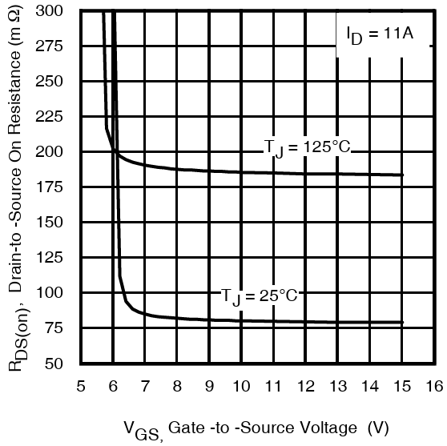
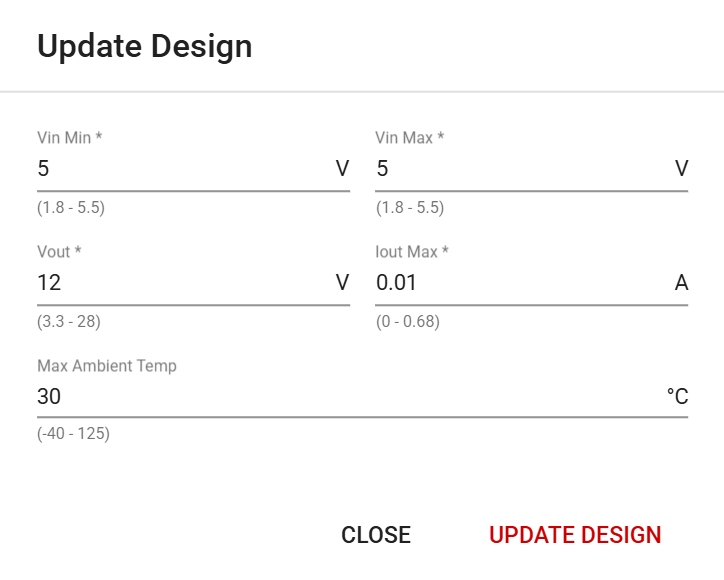
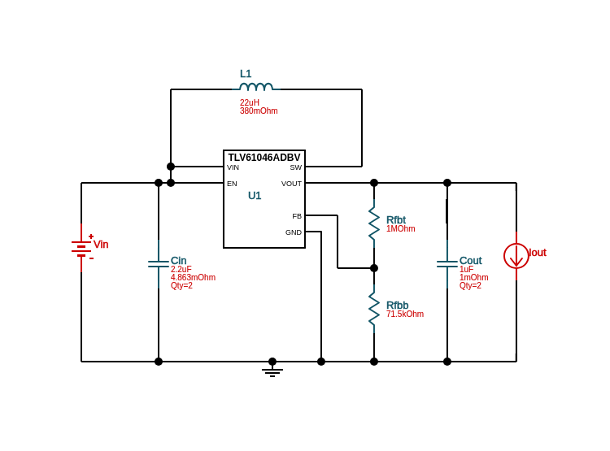
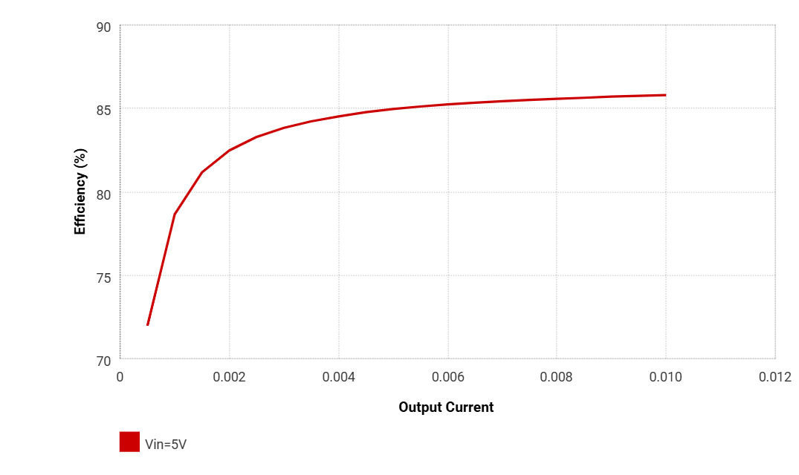
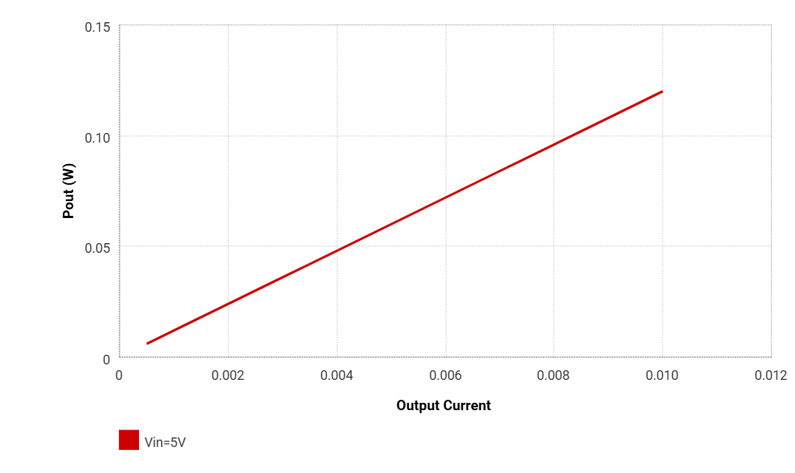
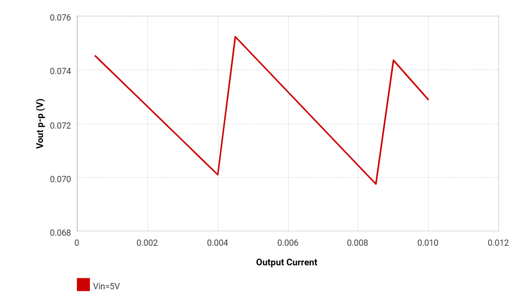
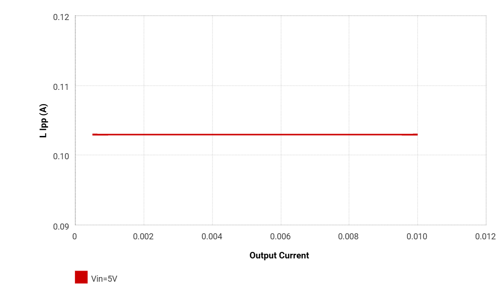

<!-- To enable math equation formatting -->

  <!-- Polyfill for older browsers (optional) -->
  

  <!-- MathJax v3 for LaTeX rendering -->
  

  <!-- Custom MathJax Configuration -->
  


# **Boost Converter Hardware**
---

The boost converter network is used to provide the necessary gate drive voltage to the MOSFETs of the H-bridge network, ensuring they are fully enhanced switches to minimize conduction losses.

The 5V logic supply ($V_{cc}$) is stepped up to 12V, and is delivered to the IR2302 gate drivers. As a result, all PWM generation signals at the control input are now effectively level shifted to 12V.

The specific electrical switches utilized for this design are the IRFB4020PBF MOSFETs, which have a device threshold voltage ranging from 3V - 4.9V according to the [IRFB4020PBF datasheet](https://www.infineon.com/dgdl/irfb4020pbf.pdf?fileId=5546d462533600a4015356158ffd1e05). This implies that driving them with standard 5V logic is not suitable, as this gate bias is only slightly above the threshold and may result in the MOSFETs operating in the saturation (active) region, where they behave more like current amplifiers rather than fully enhanced switches. To ensure efficient switching with minimal conduction losses, the MOSFETs must be driven into the ohmic (triode) region.

A key parameter that reflects the conduction efficiency of a MOSFET is the Drain-to-Source On-Resistance ($R_{DS(on)}$) which is directly influenced by the Gate-to-Source Voltage $V_{GS}$.

 

    <h7><b>Figure X.</b> IRFB4020PBF On-Resistance vs. Gate Voltage </h7>

 

As per the illustrated figure from the IRFB4020PBF datasheet, operating the MOSFET with a gate voltage of 5V results in an unacceptably high $R_{DS(on)}$ value exceeding $300m\Omega$, leading to excessive conduction losses. In contrast, a $V_{GS}$ of 12V reduces the $R_{DS(on)}$ to just about $80m\Omega$ which aligns with the design objective of having efficient, low-loss switching.

---

## WEBENCH Design

The design of the boost converter was developed using Texas Instrument's free, online WEBENCH Power Design tool which generate a complete and customizable power converter depending on user criteria. The TLV61046ADBVR boost converter IC was selected, and the finalized design is accessible for review and customization via [Texas Instruments' WEBENCH interface](https://webench.ti.com/power-designer/switching-regulator/customize/10).

The five criteria provided to the WEBENCH interface for the design are:

 

    <h7><b>Figure X.</b> Boost Converter WEBENCH Criteria </h7>

 

As observed from the figure, $V_{in}$ and $V_{out}$ is explicitly defined based on voltage requirements. $I_{outMax} = 0.010A$ is selected based on the output load current described in the next section. Given the low-current application and the absence of high-temperature environmental conditions, a conservative thermal margin of 5°C is applied, resulting in a nominal maximum ambient temperature of 30°C.

Once these parameters are provided to the WEBENCH interface, the following boost converter schematic is generated:

 

    <h7><b>Figure X.</b> TLV61046ADBVR Boost Converter Schematic </h7>

 

## WEBENCH Simulation

One convenient feature of the WEBENCH Power Designer interface is that it automatically calculates a wide range of performance metrics and displays them within the "Operating Values" window. These metrics are organized into categories such as System Information, Inductor, Power, and others. A few key operating values and diagnostic plots relevant to this design are shown below:

 

    <h7><b>Figure X.</b> Boost Converter Efficiency (η) vs. Output Current ($I_{out}$) </h7>

 

 

    <h7><b>Figure X.</b> Boost Converter Output Power ($P_{out}$) vs. Output Current ($I_{out}$) </h7>

 

 

    <h7><b>Figure X.</b> Boost Converter Output Voltage Ripple ($V_{outpp}$) vs. Output Current ($I_{out}$) </h7>

 

 

    <h7><b>Figure X.</b> Boost Converter Inductor Current Ripple ($I_{Lpp}$) vs. Output Current ($I_{out}$) </h7>

 

    <h7><b>Table X. Performance Metrics for TLV61046ADBVR Boost Converter Design </b>  </h7>

| Name           | Value      | Category           | Description                                            |
|:---------------|:-----------|:------------------- :-------------------------------------------------------|
| Vout           | 12 V       | System Information | Operational Output Voltage                             |
| Cout IRMS      | 38.15 mA   | Capacitor          | Output capacitor RMS ripple current                    |
| Cout Pd        | 727.79 nW  | Capacitor          | Output capacitor power dissipation                     |
| Efficiency     | 85.8%      | System Information | Steady state efficiency                                |
| Frequency      | 197.1 kHz  | System Information | Switching frequency                                    |
| L Ipp          | 102.95 mA  | Inductor           | Peak-to-peak inductor ripple current                   |
| L Pd           | 1.57 mW    | Power              | Inductor power dissipation                             |
| Pout           | 120 mW     | System Information | Total output power                                     |
| Mode           | DCM        | System Information | Conduction Mode                                        |
| Vout p-p       | 72.88 mV   | System Information | Peak-to-peak output ripple voltage                     |
| Duty Cycle     | 59.57%     | System Information | Duty cycle                                             |
| Total Pd       | 19.87 mW   | Power              | Total Power Dissipation                                |
| Vin            | 5 V        | System Information | Vin operating point                                    |
| Cin Pd         | 2.15 µW    | Power              | Input capacitor power dissipation                      |
| Cout Pd        | 727.79 nW  | Power              | Output capacitor power dissipation                     |
| IC Pd          | 18.29 mW   | Power              | IC power dissipation                                               |
| Vout Actual    | 11.91 V    | System Information | Vout Actual calculated based on selected voltage divider resistors |

## Output Load Current Requirement

The boost converter's intended operation is to only drive two IR2302 gate drivers. Thus, the current drawn by both gate drivers defined the total output load current of the converter. 

The current consumption of a gate driver comprises both static and dynamic current components. According to the the [IR2302 datasheet](https://www.infineon.com/dgdl/ir2302.pdf?fileId=5546d462533600a4015355c988b216de), the maximum quiescent from the $V_{cc}$ supply which also describes the static current of a gate driver is: 

$$I_{static} = I_{QCC} = 1.6mA$$

Since the power inverter network integrates two gate drivers, this results in a total static current of:

$$I_{static(total)} = 2 \times I_{static}​

$$I_{static(total)} = 2 \times I_{static} = 3.2mA$$

The dynamic current is a characteristic of the MOSFET's total gate charge and its switching frequency:

$$I_{dynamic}​ = Q_{g} ​\times f_{sw}$$

Recalling that the PWM generation frequency is 31,372Hz and the maximum total IRFB4020PBF gate charge is 29nC, the dynamic current is:

$$I_{dynamic}​ = 29nC ​\times 31,372Hz = 0.91mA$$

Considering that the power inverter topology consists of 4 MOSFETs, but only two are actively switching at any given time, the total dynamic current is:

$$I_{dynamic(total)} =​ 2 \times I_{dynamic}$$

$$I_{dynamic(total)} =​ 2 \times 0.91​ = 1.82mA$$ 

The total output load current for the boost converter to source is:

$$I_{out}​ = I_{static(total)} ​+ I_{dynamic(total)}$$

$$I_{out}​ = 3.2mA ​+ 1.82mA = 5.02mA$$

Although the selected load current for the WEBENCH boost converter design is selected as 10mA, this provides a comfortable margin to ensure sufficient current delivery to the IR2302 gate drivers, while also designing close to ideal component operating values.

## Setting the Output Voltage

The output voltage of the boost converter can be programmed using a resistor divider network connected to the feedback (FB) pin of the TLV61046ADBVR IC. The relationship between the output voltage and the resistor values is given by:

$$R_{1} = \left( \frac{V_{OUT}}{V_{REF}} - 1 \right) \times R_{2}$$

To convert to an output voltage of 12V with an internal reference voltage of 795mV, $R_{2}$ is chosen such that a value for $R_{1}$ can be computed: 

- $V_{OUT} = 12V$
- $V_{REF} = 795mV$
- $R_{2} = 71.5k\Omega$

$$R_{1} = \left( \frac{12V}{795mV} - 1 \right) \times 71.5k\Omega \approx 1M\Omega$$

Thus, $R_{1} = 1M\Omega$ is selected to achieve the desired 12 V output.
