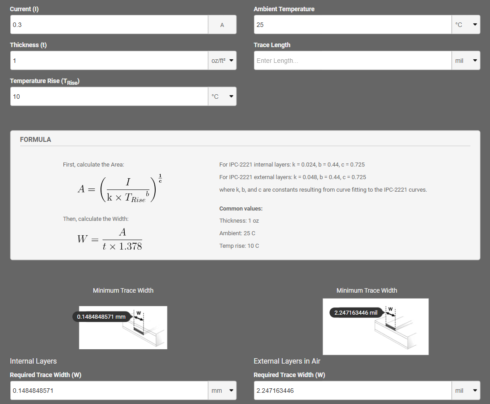

<!-- To enable math equation formatting -->

  
  


# **Buck Converter Hardware**
---

The buck converter network is main power source that supplies power to most of the Atinverter V2 chips. Specifically, it delivers power to these devices:

- ATMEGA328P
- Two TMCS1108A4BQDR (for DC and AC Current Sensing)
- LM358N and Two Bias Resistor Networks (for AC Voltage Sensing)
- SN74LVC1G32DBVR (for Overvoltage and Reset Protection)
- ADC122S021CIMM (for AC V/I Sampling)
- Four pull up and 1 bias resistor network (Resistor Arrays, I2C Level Shifter, and FTDI to USB Connector)

The buck converter chosen is 

## Determining the DC/DC Converter Output Current Needed
Requirements
{: .label } 
- Input Voltage: 12V-48V
- Output Voltage: 5V

---

## Determining the Required Input Current and PCB Trace Thickness for Switching Converters

### Chip parameters
- Chip of Interest: R-78HE-0.3
- DC-DC switching converter, not linear regulator
- Input Voltage Range: 6.5V - 48V
- Output Voltage: 5V
- Output Current: Up to 300mA
- Efficiency: Up to 83%
 
 

### Power Conversion Equations

(1) $$P_{\text{out}} = P_{\text{in}} + P_{\text{losses}}$$ 
(2) $$Efficiency = \frac{P_{\text{out}}}{P_{\text{in}}}$$ 
(3) $$P_{\text{in}}= V_{\text{in}} \times I_{\text{in}}$$ 
(4) $$P_{\text{out}}= V_{\text{out}} \times I_{\text{out}}$$ 

- Plugging in equation (3) into (2) and isolating for $$I_{\text{in}}$$ results in:

$$I_{\text{in}} = \frac{P_{\text{out}}}{V_{\text{in}} \times \text{Efficiency}}$$

### Finding the Maximum Input Current 
- Known: $$V_{\text{out_max}} = 5V, I_{\text{out_max}} = 300mA$$ 
$$P_{\text{out_max}} = 5 \times 300m = 1.5W $$

- Two cases are considered since the efficiency of the converter changes with the input voltage. 
$$V_{\text{in_max}} = 72$$, Efficiency = 72% 
$$I_{\text{in}} = \frac{1.5W}{72 \times \text{0.72}} = 0.029A$$  
$$V_{\text{in_min}} = 6.5$$, Efficiency = 83% 
$$I_{\text{in}} = \frac{1.5W}{6.5 \times \text{83}} = 0.278A$$ 

- Therefore, the maximum input current is 278mA. This is consistent with the inverse relationship between voltage and current in a DC-DC converter. Although the input current (278mA) is lower than the output current (300mA), the input voltage (6.5V) is higher than the output voltage (5V). This behavior is typical of switching converters, which take advantage of the complementary relationship between input and output voltage and current. 

- However, to be conservative, let's say the chip consumes 300mA which is the same as the output current. This is a standard technique that is employed to approximate the current drawn from the converter especially for higher efficiencies. We could have utilized this approach, but now we know how to solve for the max input current for any converter.

- Using [Digikey PCB Trace Width Calculator](https://www.digikey.com/en/resources/conversion-calculators/conversion-calculator-pcb-trace-width)

- The maximum input current is 0.3A and we are designing for a 1 oz copper thickness

- A required trace width of 0.148mm (5.83mils) is obtained
