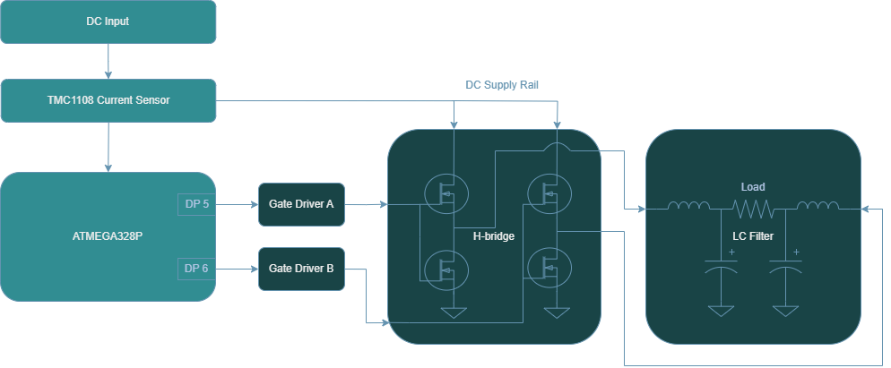
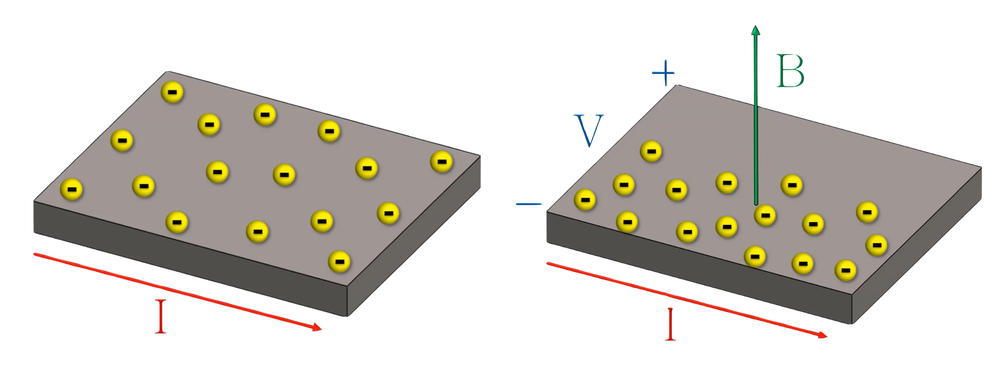

<!-- To enable math equation formatting -->

  <!-- Polyfill for older browsers (optional) -->
  

  <!-- MathJax v3 for LaTeX rendering -->
  

  <!-- Custom MathJax Configuration -->
  


# **DC Current Sensing Hardware**
---

The current at the input of the power inverter is measured using a Hall-effect current sensor which leverages its electromagnetic properties to perform an isolated, low resistive measurement. After passing through the series connected sensor, it is then delivered to the supply rails of the H-bridge where it continues standard PWM inversion operation.
 
 

    <h7><b>Figure X.</b> DC Current Sensing Block Diagram </h7>

## Hall-Effect Theory

To understand Hall-effect current sensors, it is useful to have an understanding of the two fundamental laws of electromagnetism:
1. Lorentz Force Law
2. Ampere's Law

Instead of merely defining the laws, this section examines how they manifest themselves in the operation of the device.

Consider a conductive element where a current flows. The yellow balls represent electrons that are evenly distributed when flowing through a conductor. The current flow is denoted as "I".

Ampere's law gives rise to a magnetic field generated around the conductor in accordance with the right-hand rule and it is proportional to the current that is flowing. Additionally, if an external magnetic field is applied near the conductor (strongest when perpendicular due to Lorentz force), the electrons will be deflected and accumulate in one area leaving the opposite side with a net positive charge. The charge separation between both ends can be measured — known as the hall-voltage.

    <h7><b>Figure X.</b> (a) Uniform Electron Distribution in a Current-Carrying Conductor   (b) Electron Accumulation Due to Lorentz Force Under a Magnetic Field  </h7>

## TMCS1108 Current Sensor

In this design, the Hall-effect current sensor of choice is the **TMCS1108**. It internally measures the hall-voltage and amplifies it to produce an **analog voltage output which is proportional to the sensed current**. This analog voltage can be calculated using the [TMCS1108 datasheet](https://www.ti.com/lit/ds/symlink/tmcs1108.pdf?HQS=dis-dk-null-digikeymode-dsf-pf-null-wwe&ts=1744785799224) provided equation in page 12:

$$V_{OUT} = S \times I_{IN} + V_{OUT,0A}$$

where:
- $V_{OUT}$ is the analog output voltage. 
- S is the ideal sensitivity of the device. 
- $I_{IN}$ is the isolated input current. 
- $V_{OUT,0A}$ is the zero current output voltage for the device variant.

As this design employs the **TMCS1108A4BQDR** device variant, this features a sensitivity of 400mV/A. This describes the relation between the output analog voltage and current input where the output changes 400mV for every 1A of detected current. Higher sensitivities are generally favorable, as they result in a greater voltage response per unit of current.

The non-zero current output is due to the device bidirectionality of the sensor, where the output is centered at mid-supply as noted in page 3 of the [TMCS1108 datasheet](https://www.ti.com/lit/ds/symlink/tmcs1108.pdf?HQS=dis-dk-null-digikeymode-dsf-pf-null-wwe&ts=1744785799224).

$$V_{OUT,0A} = 0.5 × V_{S}$$

where:
- $V_{OUT,0A}$ is the zero current output voltage for the device variant.
- $V_{S}$ is the supply voltage to the chip.

Since the chip is powered by a 5V supply, at no current input, the output analog voltage resides at 2.5V. For positive current, the output voltage increases above 2.5V and conversely for negative current, the output decreases below 2.5V.

The analog output voltage is then measured by the analog pin of our ATMEGA328P, where it is converted to a digital value between the range of 0-1023. After the MCU has an understanding of what the voltage signal is in the digital domain, the current for the DC input is computed using a restructured form of the previous equation.

$$I_{IN} = \frac{V_{OUT} - V_{OUT,0A}}{S}$$

This conversion ultimately produces an accurate current reading based on the previously discussed hall-effect phenomenon and fulfills the goal of measuring the DC input current of the Atinverter V2 device.