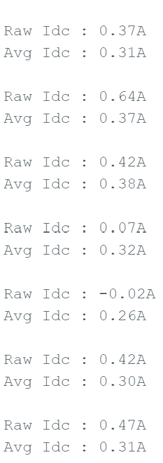

<!-- To enable math equation formatting -->

  <!-- Polyfill for older browsers (optional) -->
  

  <!-- MathJax v3 for LaTeX rendering -->
  

  <!-- Custom MathJax Configuration -->
  


# **Experimentation**
***
 
The experimentation is predicated on the sequential testing of the fully populated Atinverter V2 PCB as well as its integration with various software modules to evaluate and diagnose system-level functionality. 

Standard PCB assembly practices were observed throughout the process, including component orientation checks, solder joint inspections, thorough visual examination, and continuity testing.

To successfully validate the operation of the Atinverter V2 device, verification of the following core subsystems is required: 
- 5V Buck and 12V Boost Power Supplies
- ATMEGA328P Bootloaded Status
- PWM Inversion
- DC Voltage and Current Sensing
- AC Voltage and Current Sensing

In the next few sections, each subsystem is reported on their verification status, both from a hardware and software functionality standpoint.

## Workbenches
In order to conduct proper testing, a reliable work bench was operated to conduct the various

## 5V Buck and 12V Boost Power Supplies

 

    <h7><b>Figure X.</b> R-78HE5.0-0.3 5V Buck Output </h7>

 

 

    <h7><b>Figure X.</b> TLV61046ADBVR 12V Boost Output </h7>

 

 

    <h7><b>Figure X.</b> TLV61046ADBVR 12V Boost Output Ripple </h7>

 

## ATMEGA328P Bootloaded Status

- Verification of `Blink.ino' software and ATMEGA328P bootloaded state

 

    <h7><b>Figure X.</b> Atinverter V2 Visual LED Blinking </h7>

 

ATMEGA328P is functional and performs LED blinking as expected from the 'Blink.ino' program

## PWM Inversion

### PWM Generation

- Verification of `50Hz_PWM_Inverter.ino' and '60Hz_PWM_Inverter.ino software and ATMEGA328P bootloaded state

 

    <h7><b>Figure X.</b> PWMA (Yellow) and PWMB (Green) Waveforms with $f_{sw} = 31,372kHz, f_{ac} = 50Hz$ </h7>

 

 

    <h7><b>Figure X.</b> PWMA (Green) and PWMB (Yellow) Waveforms with $f_{sw} = 31,372kHz, f_{ac} = 60Hz$ </h7>

 

### Gate Driver

 

    <h7><b>Figure X.</b> High Side Switch Gate Drive Waveforms, PWMA_HO (Color) and PWMB_HO (Color), Low Side Switch Gate Drive Waveforms, PWMA_LO (Color) and PWMB_LO (Color), with $V_{DC_{in}} = 12V$ and $f_{ac} = 50Hz$ </h7>

 

 

    <h7><b>Figure X.</b> High Side Switch Gate Drive Waveforms, PWMA_HO (Color) and PWMB_HO (Color), Low Side Switch Gate Drive Waveforms, PWMA_LO (Color) and PWMB_LO (Color), with $V_{DC_{in}} = 12V$ and $f_{ac} = 60Hz$ </h7>

 

### H-Bridge and LC Filter

 

    <h7><b>Figure X.</b> 50Hz Output Waveform at Load+ (Green) and Load− (Yellow) with $V_{DC_{in}} = 12V$ </h7>

 

 

    <h7><b>Figure X.</b> 50Hz Differential AC Output Waveform (Pink) with $V_{DC_{in}} = 12V$ </h7>

 

 

    <h7><b>Figure X.</b> 60Hz Output Waveform at Load+ (Green) and Load− (Yellow) with $V_{DC_{in}} = 12V$ </h7>

 

 

    <h7><b>Figure X.</b> 60Hz Differential AC Output Waveform (Pink) with $V_{DC_{in}} = 12V$</h7>

 

## Sensing Networks

The fundamental frequency of operation (50Hz or 60Hz) should not significantly affect the input current reading voltage and current sensing values for 12V is reflec 

## DC Voltage Sensing

 

    <h7><b>Figure X.</b> 12V DC Input Multimeter Measurement (Color) </h7>

 

 

    <h7><b>Figure X.</b> Arduino IDE Serial Monitor DC Voltage Readouts </h7>

 

## DC Current Sensing

 

    <h7><b>Figure X.</b> Arduino IDE Serial Monitor DC Current Readouts for $24.5\Omega$ Load </h7>

 

 

    <h7><b>Figure X.</b> Arduino IDE Serial Monitor DC Current Readouts for $18\Omega$ Load </h7>

 

## AC Voltage Sensing

 

    <h7><b>Figure X.</b> 12V DC Input Waveform (Color) </h7>

 

 

    <h7><b>Figure X.</b> Arduino Serial Monitor DC Voltage Readouts (Color) </h7>

 

## AC Current Sensing