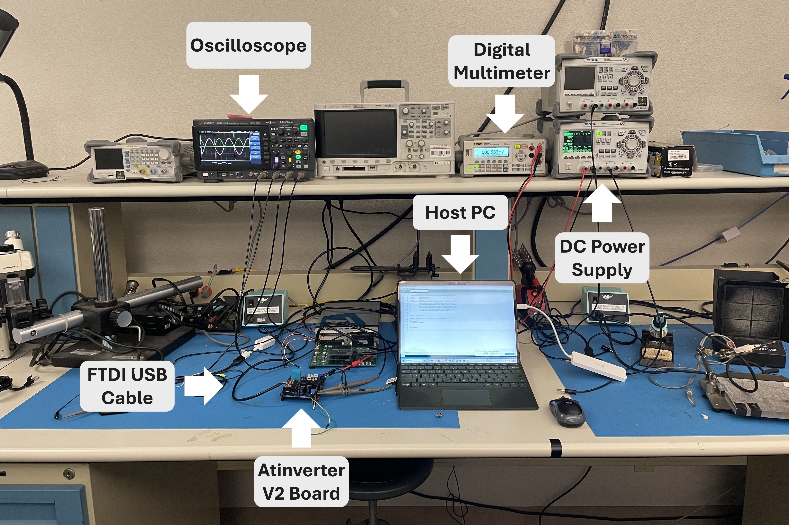
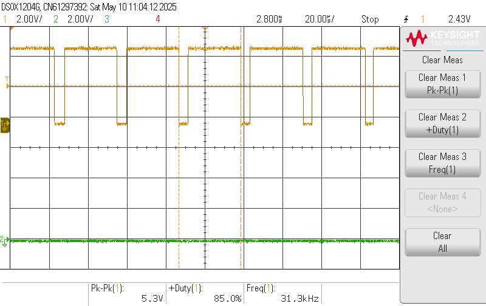
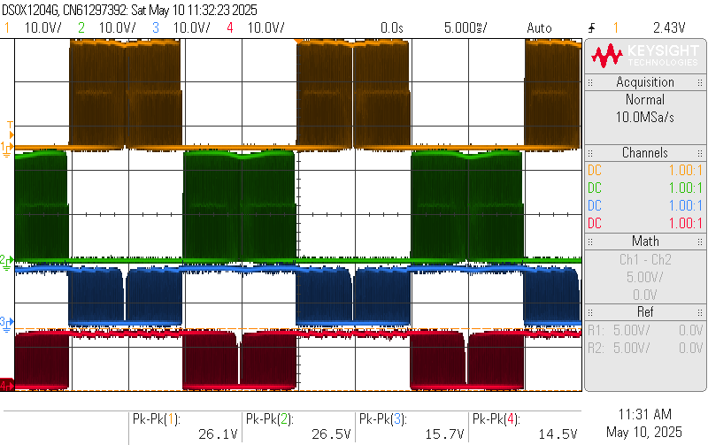

<!-- To enable math equation formatting -->

  <!-- Polyfill for older browsers (optional) -->
  

  <!-- MathJax v3 for LaTeX rendering -->
  

  <!-- Custom MathJax Configuration -->
  


# **Experimentation**
***
 
The experimentation is predicated on the sequential testing of the fully populated Atinverter V2 PCB as well as its integration with various software modules to evaluate and diagnose system-level functionality. 

Standard PCB assembly practices were observed throughout the process, including component orientation checks, solder joint inspections, thorough visual examination, and continuity testing.

To successfully validate the operation of the Atinverter V2 device, verification of the following core subsystems is required: 
- 5V Buck and 12V Boost Power Supplies
- ATMEGA328P Bootloaded Status
- PWM Inversion
- DC Voltage and Current Sensing
- AC Voltage and Current Sensing

In the next few sections, each subsystem is reported on their verification status, both from a hardware and software functionality standpoint.

## Workbenches
To facilitate thorough testing of the various subsystems, two reliable workbenches were utilized. The primary workbench served as the main station for general testing activities, while the secondary workbench was dedicated specifically to validating the DC and AC current sensing functionality of the Atinverter V2 board.

 

    <h7><b>Figure X.</b> Main Workbench </h7>

 

The DC input is powered by a Rigol DP832, using one or two of the channels depending on the voltage needed. When voltages requirements are above 30V, channels 1 and 2 are configured in series to deliver up to a 48V. The DM3058E digital multimeter is used to precisely measure the value of both the DC input voltage and the load resistance. The Keysight DSOX1204G oscilloscope captures key waveforms of the Atinverter V2 board including the  power supply levels and the power inverter signals from the input to output. The host PC operates as the software hub, as this is where the user selects and uploads the firmware to the Atinverter V2 board via the FTDI to USB cable.

 

    <h7><b>Figure X.</b> Workbench for Verifying DC and AC Current Sensing </h7>

 

The second workbench builds upon the main setup and is optimized for testing the DC and AC current sensing functionality. It consists of the previously mentioned instruments, but with the addition of a current probe and current probe amplifier (Tektronix AM503). The current probe operates on the principle of magnetic induction, where it senses the current flowing through the conductor that clamps around the wire carrying the load current.

To ensure accurate scaling of the current signal, the oscilloscope is set to a fixed vertical scale value 10mV/div and the amplifier gain is adjusted accordingly based on the expected current magnitude.
A high power resistive load box is connected to the output of the Atinverter V2 to set a known load condition for the DC and AC current tests.

In the following sections, a series of captures and data are displayed to report on the Atinverter V2 device behavior. 

## 5V Buck and 12V Boost Power Supplies

 

    <h7><b>Figure X.</b> R-78HE5.0-0.3 5V Buck Output </h7>

 

 

    <h7><b>Figure X.</b> TLV61046ADBVR 12V Boost Output </h7>

 

 

    <h7><b>Figure X.</b> TLV61046ADBVR 12V Boost Output Ripple </h7>

 

- Power supplies are functional, marginal deviations from the expected value.
- 12V Boost converter peak=to-peak ripple is significantly larger than the simulated value (72.88 mV as per the [Boost Converter](\bost_conv_hw) section), but not an issue since the output is still within the power supply conditions of the IR2302 (5V-20V).

## ATMEGA328P Bootloaded Status

- Verification of `Blink.ino` software and ATMEGA328P bootloaded state

 

    <h7><b>Figure X.</b> Atinverter V2 Visual LED Blinking </h7>

 

- ATMEGA328P is operational and performs LED blinking as expected

## PWM Inversion

This sections focuses on the verification of `50Hz_PWM_Inverter.ino` and `60Hz_PWM_Inverter.ino` software and ATMEGA328P bootloaded state.

### PWM Generation

 

    <h7><b>Figure X.</b> PWMA (yellow) and PWMB (green) Waveforms with $f_{sw} = 31,372kHz, f_{ac} = 50Hz$ </h7>

 

 

    <h7><b>Figure X.</b> PWMA (yellow) and PWMB (green) Waveforms with $f_{sw} = 31,372kHz, f_{ac} = 60Hz$ </h7>

 

 

    <h7><b>Figure X.</b> PWMA (yellow) Switching Frequency Verification </h7>

 

 

    <h7><b>Figure X.</b> PWMB (green) Switching Frequency Verification </h7>

 

- The PWM generation by the ATMEGA328P's digital pins is functioning as intended. The PWM outputs exhibit a 180° phase offset as they are complementary and align with the expected fundamental and switching frequencies of 50Hz or 60Hz and 31.372kHz respectively.

### Gate Driver

 

    <h7><b> Figure X.</b> High- and Low-side Switch Gate Driver Waveforms of $f_{ac} = 50Hz$, Respectively: PWMA_HO (yellow), PWMB_HO (green), PWMA_LO (blue), and PWMB_LO (red) </h7>

 

 

    <h7><b> Figure X.</b> High- and Low-side Switch Gate Driver Waveforms of $f_{ac} = 60Hz$, Respectively: PWMA_HO (yellow), PWMB_HO (green), PWMA_LO (blue), and PWMB_LO (red) </h7>

 

- The software generated PWM waveforms provided to the input of the gate drivers are properly level-shifted for both the high-side gate drive output (HO) and low-side gate drive output (LO). The LO output is level-shifted from the 5V logic input to 12V due to the internal CMOS structure of the IR2302, which toggles the output between ground and the 12V gate driver supply. The HO, is level-shifted from the 5V logic input to approximately 24V. This level shift is a result of the 12V gate driver supply connected to the $V_{B}$ node through a diode and the bootstrap capacitor voltage which adds another 12V when fully charged. This bootstrap capacitor is charged when the low-side switch is active while the high-side switch is on and vice versa when the high-side switch is active and the low-side switch is off, the bootstrap capacitor discharges to the HO node.

### H-Bridge and LC Filter

 

    <h7><b>Figure X.</b> 50Hz Output Waveform at Load+ (yellow) and Load− (green) with $V_{DC_{in}} = 12V$ </h7>

 

 

    <h7><b>Figure X.</b> 50Hz Differential AC Output Waveform (pink) with $V_{DC_{in}} = 12V$ </h7>

 

 

    <h7><b>Figure X.</b> 50Hz Output Waveform at Load+ (yellow) and Load− (green) with $V_{DC_{in}} = 48V$ </h7>

 

 

    <h7><b>Figure X.</b> 50Hz Differential AC Output Waveform (pink) with $V_{DC_{in}} = 48V$ </h7>

 

 

    <h7><b>Figure X.</b> 60Hz Output Waveform at Load+ (yellow) and Load− (green) with $V_{DC_{in}} = 12V$ </h7>

 

 

    <h7><b>Figure X.</b> 60Hz Differential AC Output Waveform (pink) with $V_{DC_{in}} = 12V$</h7>

 

 

    <h7><b>Figure X.</b> 60Hz Output Waveform at Load+ (yellow) and Load− (green) with $V_{DC_{in}} = 48V$ </h7>

 

 

    <h7><b>Figure X.</b> 60Hz Differential AC Output Waveform (pink) with $V_{DC_{in}} = 48V$</h7>

 

- The PWM inverter was subjected to testing between the predefined range of 24V - $96V_{pkpk}$ using a 12V - 48V DC input. Oscilloscope captures were obtained at both fundamental frequencies of 50Hz and 60Hz, measuring across the load terminals to illustrate how the differential AC waveform is synthesized from the positive and negative half-cycles. Overall, the output waveform behavior is consistent with theoretical expectations.

## Sensing Networks

This portion of the report addresses the four sensing operations for the power inverter and insights discovered after testing. Although this section does not make the distinction between the 50Hz or 60Hz fundamental frequency testing, this is intentional as the sensed values are not expected to vary significantly with frequency. Testing was performed for the DC input voltage of 12V - 48V with representative results for both 12V and 48V documented in this section.

 

    <h7><b>Figure X.</b> 12V DC Input Multimeter Measurement </h7>

 

 

    <h7><b>Figure X.</b> 48V DC Input Multimeter Measurement </h7>

 

### DC Voltage Sensing

 

    <h7><b>Figure X.</b> Arduino IDE Serial Monitor DC Voltage Sensing Start Up with $V_{DC_{in}} = 12V$ </h7>

 

 

    <h7><b>Figure X.</b> Arduino IDE Serial Monitor DC Voltage Sensing Steady State with $V_{DC_{in}} = 12V$</h7>

 

 

    <h7><b>Figure X.</b> Arduino IDE Serial Monitor DC Voltage Sensing Start Up with $V_{DC_{in}} = 48V$ </h7>

 

 

    <h7><b>Figure X.</b> Arduino IDE Serial Monitor DC Voltage Sensing Steady State with $V_{DC_{in}} = 48V$</h7>

 

- Execution of the `Vdc_Sensing.ino` program at both 12V and 48V DC levels produces results that are quite favorable. Start up conditions were in accordance with expected operation as the running average logic tells us that the DC voltage value improves in accuracy once it completely fills its buffer. Additionally, under steady-state conditions the sensed voltage closely matched the measured value, with deviations limited to a few tens of millivolts—well within the acceptable range for this design.

### DC Current Sensing

 

    <h7><b>Figure X.</b> Arduino IDE Serial Monitor DC Current Readouts for $24.5\Omega$ Load </h7>

 

 

    <h7><b>Figure X.</b> Arduino IDE Serial Monitor DC Current Readouts for $18\Omega$ Load </h7>

 

### AC Voltage Sensing

 

    <h7><b>Figure X.</b> Arduino IDE Serial Monitor AC Voltage Sensing with $V_{DC_{in}} = 12V$</h7>

 

 

    <h7><b>Figure X.</b> Arduino IDE Serial Monitor AC Voltage Sensing with $V_{DC_{in}} = 48V$ </h7>

 

- The `Vac_Sensing.ino` program was evaluated at both 12V and 48V DC input levels which correspond to expected RMS output voltages of $\frac{12V}{\sqrt{2}} \approx 8.49V$ and $\frac{48V}{\sqrt{2}} \approx 33.94V$. Unlike the DC sensing routine, the AC voltage sensing program does not differentiate between startup and steady-state conditions, as it employs a fixed time-based sampling window instead of a running average. 

- The AC voltage RMS sensing was found to be fairly accurate for 12V DC input level, with only millivolt deviations. However, for 48V DC input, data readouts were quite erroneous, with a discrepancy of about 8V. After looking into the matter, it was discovered that the a sampling resistor $R_{samp}$

### AC Current Sensing