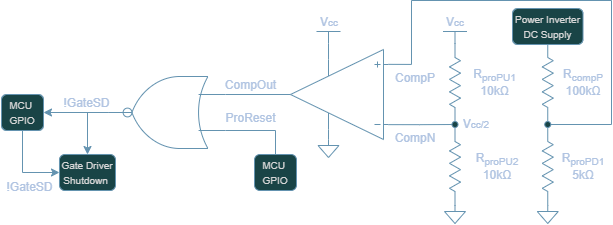
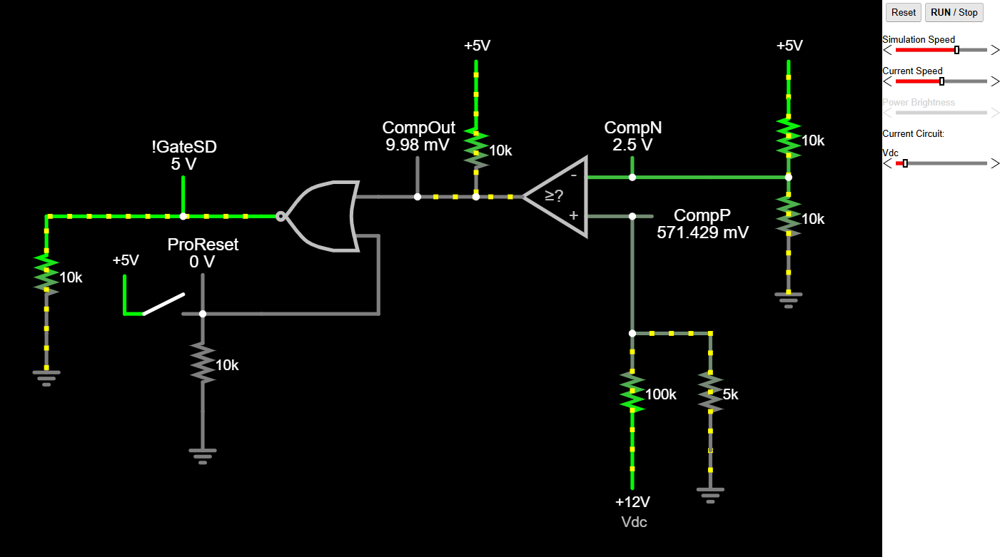

<!-- To enable math equation formatting -->

  <!-- Polyfill for older browsers (optional) -->
  

  <!-- MathJax v3 for LaTeX rendering -->
  

  <!-- Custom MathJax Configuration -->
  


# **Overvoltage and Reset Protection Hardware**
---

The goal is to implement a mechanism such that the output of the power inverter is disabled when the H-bridge DC input supply exceeds a safe operating voltage or when the system is manually reset via a user command. This forms the basis of the **Overvoltage and Reset Protection** feature (OVRP). Without these two components of protection hardware in place, the output could remain active at unsafe voltages and the user would not be able to able to have real-time control of the inverter's operational state.

To implement this functionality, the following circuit was designed:

    <h7><b>Figure X.</b> Overvoltage and Reset Protection Circuitry </h7>

It consists of a comparator op-amp, a NOR logic gate, and a few resistors for pull up/down and voltage division functionality. Although not explicitly displayed on the diagram, it is useful to know that the nets !GateSD and ProReset are connected to pull down resistors and CompOut is connected to a pull up resistor.

## Functionality Breakdown

### Overvoltage Detection

The overvoltage detection is handled by the op amp comparator. It monitors a scaled voltage of H-bridge DC supply at the positive input (CompP) and compares it to a fixed 2.5V reference at the negative input (CompN). 

The scaled DC supply voltage at CompP is produced using a voltage divider consisting of $R_{compP}$ and $R_{proPD1}$:

$$V_{CompP} = V_{DC} \times \frac{R_{proPD1}}{R_{compP} + R_{proPD1}}$$

The shutdown threshold to set to 52.5V (2.5V scaled voltage), which includes a 4.5 V margin above the inverter's max design input of 48 Vpk, to accommodate transient spikes and power supply variation.

$$V_{CompP} = 52.5V \times \frac{5k\Omega}{100k\Omega + 5k\Omega} = 2.5V$$ 

The 2.5V reference voltage at CompN is generated from the logic supply voltage using a symmetric voltage divider formed by $R_{proPU1}$ and $R_{proPU2}$:

$$V_{CompN} = V_{cc} \times \frac{R_{proPU2}}{R_{proPU2} + R_{proP12}}$$

$$V_{CompN} = 5V \times \frac{10k\Omega}{10k\Omega + 10k\Omega} = 2.5V$$ 

When the scaled inverter supply at CompP exceeds the reference voltage at CompN:

$$V_{CompP} > V_{CompN}$$

the comparator output (CompOut) goes high, triggering a shutdown condition.

### Manual Reset Control

A shutdown can also be triggered using the ProReset line, which is driven by an ATMEGA328P GPIO.
A logic high on ProReset will cause the NOR gate output (!GateSD) to go low, disabling the gate drivers.

### Logic Combination 

The NOR gate ensures that an overvoltage condition, manual reset, or both will assert a logic low at the !GateSD line, thereby disabling the IR2302 gate drivers and halting PWM inversion. Understanding the state of the !GateSD pin is dictated by the following table:

    <h7><b>Table X.</b> NOR Gate Output for !GateSD Based on CompOut and ProReset </h7>

| CompOut | ProReset | !GateSD | Gate Driver State    |
|:-------:|:--------:|:-------:|:--------------------:|
|   0     |    0     |    1    | Enabled *(normal operation)* |
|   0     |    1     |    0    | Disabled *(manual reset)* |
|   1     |    0     |    0    | Disabled *(overvoltage)* |
|   1     |    1     |    0    | Disabled *(both conditions)* |

In the case that the shutdown pins of the gate drivers are desired to be controlled independently of the OVRP, it is possible to override this behavior by manually controlling the !GateSD line via software. However, this is not recommended in normal operation, as it bypasses the automatic protection logic.

## Simulation

The OVRP circuit was simulated using Falstad, a free online circuit simulator. The interactive simulation can be accessed using the following [link](https://tinyurl.com/22kyotro).

    <h7><b>Figure X.</b> Overvoltage and Reset Protection Simulation Circuit </h7>

To interact with the simulation:
- Use the Vdc slider to vary the H-bridge DC supply voltage.
- Toggle the ProReset switch to simulate the state of the ATMEGA328P GPIO pin that controls manual reset.

The Vdc overvoltage threshold is configured to 52.5V as previously discussed. When this value is exceeded, !GateSD should trigger low, which disables the gate drivers.