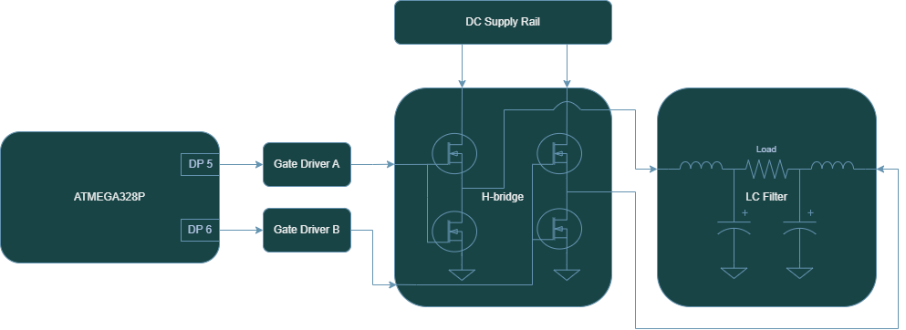

# **Power Inverter Hardware**
---

## 〰️ PWM Generation
The power inverter operation is catalyzed by the **PWM generation** from the **ATMEGA328P**. This MCU generates **pulse-width modulated (PWM) square waves** that, when combined with an appropriate switching circuit and filtering stage, can approximate the output of a **pure sine wave power inverter.** 

While there are other simpler approaches that can be employed to achieve inversion, such as square wave or modified square wave inverters, this one achieves **higher levels of waveform fidelity**. In other words, this modulation technique allows our output waveform to behave and appear more like a **real sine wave.**

Source: [Different Types of AC signals Produced by Inverters](https://www.e-education.psu.edu/eme812/node/711)

## 🧠 Gate Drivers
The next stage in the power signal chain is the gate driver circuit. It performs two main tasks:
1. Effectively level shifts the low voltage PWM signals from the ATMEGA328P into higher voltages required by the H-bridge circuit.
2. Enhance the current delivery to the power transistors to swiftly charge and discharge the gate capacitance of the transistors to ensure rapid switching of the devices.

## 🔁 H-Bridge Topology
Being composed of **4 power transistors** that complimentarily **switch at a specific frequency**, the H-bridge topology is a conventional design that is widely implemented in many pure sine wave inverters. This design **enables the connected load to experience a positive and negative voltage swing** solely based on switching states, effectively eliminating the need for a negative supply rail. This dual-polarity effect is what allows for the production of a full AC swing across the load and is achieved by PWM control signals as well as only one DC supply. 

## 🔉 LC Filter
Prior to the delivering the power to the load, a low pass filter stage is employed to:
1. Remove high frequency content, especially the switching frequency of the PWM signals.
2. Preserve the fundamental frequency of interest. In our case, our PWM-based inverter is designed for 50 or 60Hz.

## 🧩 Power Inverter Summary
After providing an overview of each of the power inverter stages, from PWM generation to filtering, consider the diagram below illustrating the signal chain:

    <h7><b>Figure X.</b> PWM Inverter Signal Chain </h7>

To clarify subtle details about the diagram, DP5 and DP6 represent the digital pins 5 and 6 respectively. Also, two gate drivers were implemented into the design since each controls one pair of transistors.