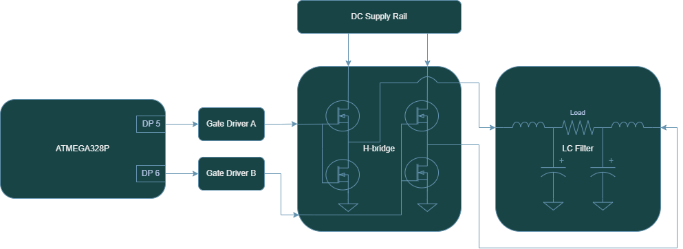

# **Power Inverter Hardware**
---

The Atinverter V2 power inverter is based on a single phase PWM inverter topology that is software-configurable for either 50Hz or 60Hz output. Pulse-width modulation (PWM) signals are generated by the ATMEGA328P microcontroller unit (MCU) using its hardware PWM pins. This signal is conditioned by a pair of gate drivers before being delivered to the H-bridge topology which converts the control signals into power signals. Once this power signal is filtered to attenuate high frequency content using a dual-LC filter, it is delivered to the load. 

    <h7><b>Figure X.</b> Power Inverter Signal Chain </h7>

While the majority of the inverter architecture was carried over from the original Atinverter V1 design, two key hardware modifications were introduced in this iteration:
- **Reduced bootstrap capacitor size:** Decreased from 4.7 µF to 1 µF to limit inrush current and enhance switching efficiency.
- **Higher gate drive voltage:** The MOSFETs are now driven at a gate-to-source voltage of 12V instead of 5V, significantly improving conduction efficiency and reducing switching losses.

The following sections provide a more detailed breakdown of each stage within the inverter signal chain.

## 〰️ PWM Generation
The power inverter operation is catalyzed by the **PWM generation** from the **ATMEGA328P**. This MCU generates **pulse-width modulated (PWM) square waves** that, when combined with an appropriate switching circuit and filtering stage, can approximate the output of a **pure sine wave power inverter.** 

While there are other simpler approaches that can be employed to achieve inversion, such as square wave or modified square wave inverters, this one achieves **higher levels of waveform fidelity**. In other words, this modulation technique allows our output waveform to behave and appear more like a **real sine wave.**

Source: [Different Types of AC signals Produced by Inverters](https://www.e-education.psu.edu/eme812/node/711)

## 🧠 Gate Drivers
The next stage in the power signal chain is the gate driver circuit. It performs two main tasks:
1. Enabling high-side transistor drive capability in H-bridge through a bootstrap circuitry by level shifting the low-voltage PWM signals from the ATMEGA328P to higher voltages
2. Enhance current delivery to the power transistors by sourcing gate drive current from an external supply, enabling rapid charging and discharging of gate capacitance for efficient switching.

## 🔁 H-Bridge Topology
Being composed of **4 power transistors** that complimentarily **switch at a specific frequency**, the H-bridge topology is a conventional design that is widely implemented in many pure sine wave inverters. This design **enables the connected load to experience a positive and negative voltage swing** solely based on switching states, effectively eliminating the need for a negative supply rail. This dual-polarity effect is what allows for the production of a full AC swing across the load and is achieved by PWM control signals as well as only one DC supply. 

## 🔉 LC Filter
Prior to the delivering the power to the load, a low pass filter stage is employed to:
1. Remove high frequency content, especially the switching frequency of the PWM signals.
2. Preserve the fundamental frequency of interest. In our case, our PWM-based inverter is designed for 50 or 60Hz.