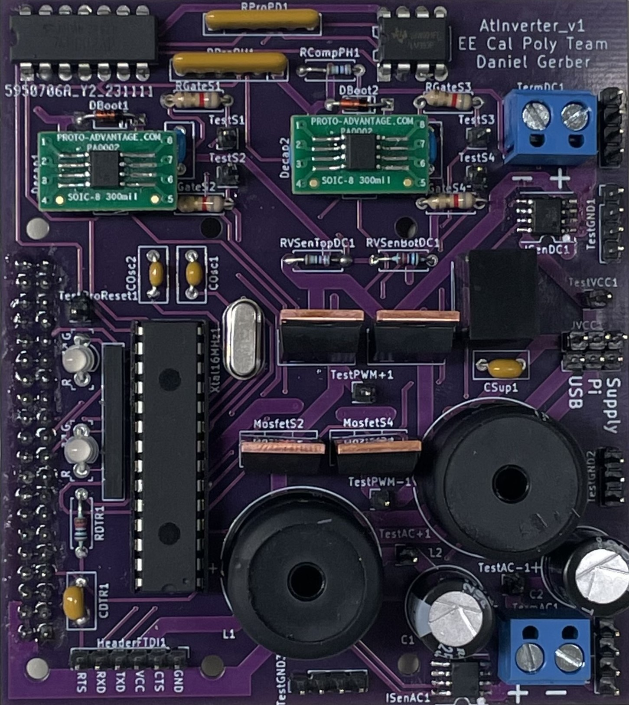
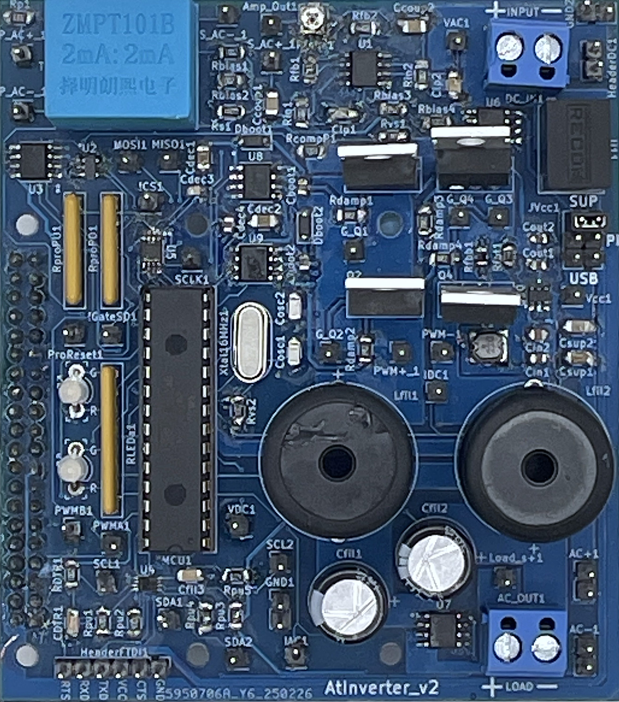

# **Hardware**
***

<html>
<head>
  
</head>
<body>
  

    <!-- Atinverter V1 Image and Button -->
    

      
       
      
      <a href="a_v1_hw" class="btn btn-purple">Atinverter V1</a>
      
    

    <!-- Atinverter V2 Image and Button -->
    

      
       
      
      <a href="atinverter_v2/a_v2_hw" class="btn btn-green">Atinverter V2</a>
      
    

  

</body>
</html>

