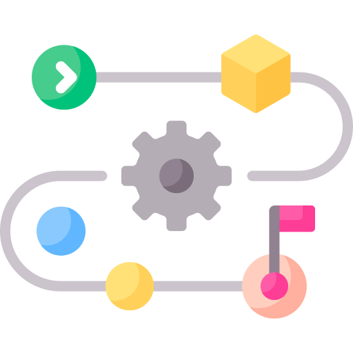
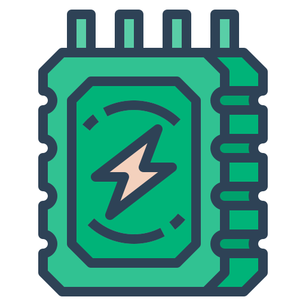

# **Atinverter Documentation**
### Explore the documentation to learn more about this open source power converter!

<html>
<head>
  
</head>
<body>
  

    <!-- Vision Image and Button -->
    

      
       
      
      <a href="/vision" class="btn btn-purple">Vision</a>
      
    

    <!-- Hardware Image and Button -->
    

      
       
      
      <a href="/hardware" class="btn btn-blue">Hardware</a>
      
    

    <!-- Software Image and Button -->
    

      
       
      
      <a href="/software" class="btn btn-green">Software</a>
      
    

  

</body>
</html>

