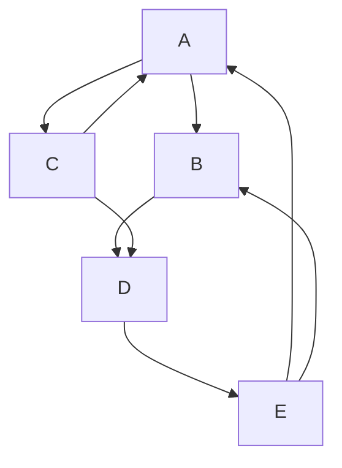
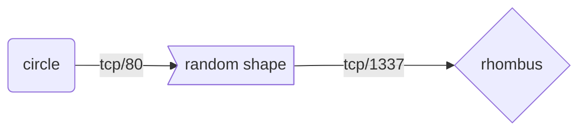
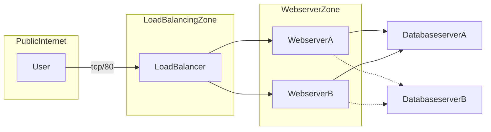
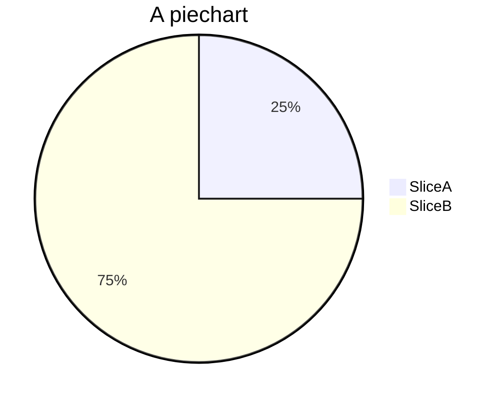
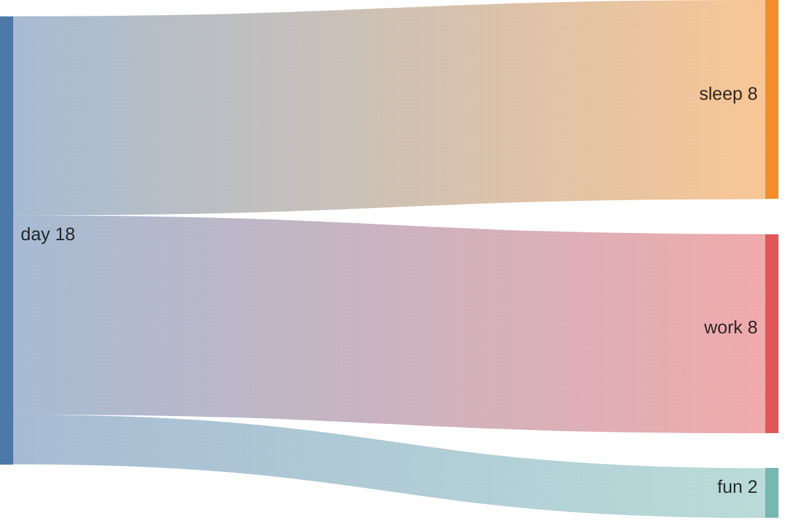

# Testing

First Term
: This is the definition of the first term.

Second Term
: This is one definition of the second term.
: This is another definition of the second term.

~~The world is flat.~~ We now know that the world is round.


This sentence uses `$` delimiters to show math inline: $\sqrt{3x-1}+(1+x)^2$

<mark>highlight</mark>

X<sup>2</sup>


``Use `code` in your Markdown file.``

H<sub>2</sub>0

I need to highlight these <mark>very important words</mark>.

## Callouts

{: .warning }
> A paragraph

{: .new }
> > A paragraph
> >
> > Another paragraph
> >
> > The last paragraph

{: .highlight-yellow }
Highlight yellow

{: .highlight-blue }
Highlight blue

{: .highlight-green }
Highlight green

{: .highlight-red }
Highlight red

{: .highlight-greylt }
Highlight greylt

{: .highlight }
Test 2

{: .note }
A paragraph

{: .important }
> A paragraph
>
> Another paragraph
>
> The last paragraph

{: .new-title }
> New title

{: .new-title }
> **"Why not simply use the `delay()` or `millis()` functions to accomplish this?"**


## Italicizing and Bolding

*Lorem ipsum*

**Lorem ipsum**

***lorem ipsum***

Gone camping! :tent: Be back soon.

That is so funny! :joy:

:smile:  
😀

## Tables
| head1        | head two          | three |
|:-------------|:------------------|:------|
| ok           | good swedish fish | nice  |
| out of stock | good and plenty   | nice  |
| ok           | good `oreos`      | hmm   |
| ok           | good `zoute` drop | yumm  |

## Code  blocks
This is `code`

``` c
const a = 10;
static var;
```

## Creating a Link
Relative link within the directories:  
[This is a link](software/modules/modules.html)  
External Link:
[Arduino Docs](https://docs.arduino.cc/)

## Images


> hey
> test
>> oh my
>>> sheesh

## Putting lines in between

hi

***

there

## Creating an ordered list of items
1. bananas
2. apples
3. durian

## Creating an unordered list of items
* bananas
* apples
* durian
    * cherries

## Tables

| Col 1 | Col 2 |
| -----  | :-----: |

- [ ] hello, this is a todo item
- [ ] hello, this is another todo item
- [x] goodbye, this item is done












> {: .new }
> > A paragraph
> >
> > Another paragraph
> >
> > The last paragraph

- Understanding how to communicate between the ADC122S021 and the ATMEGA328P using the SPI protocol for serial transfer of AC voltage data. 