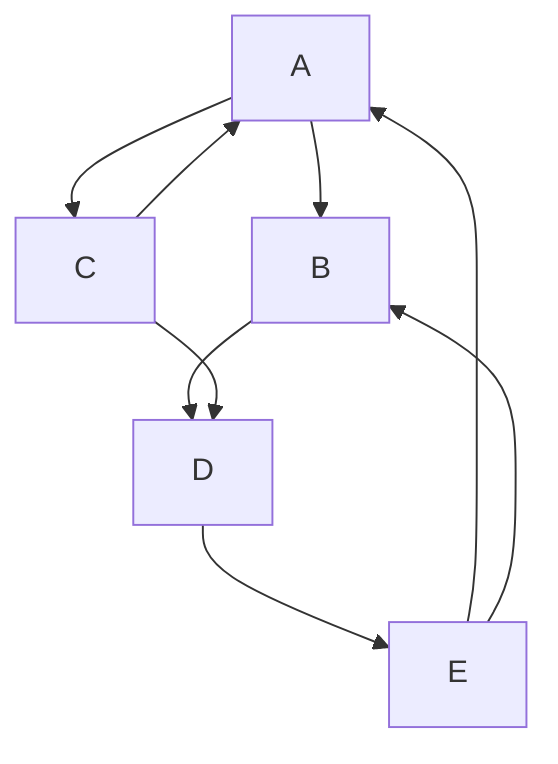
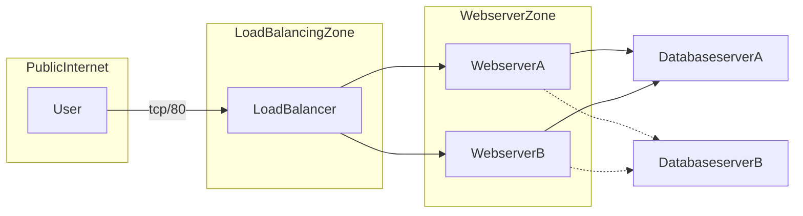
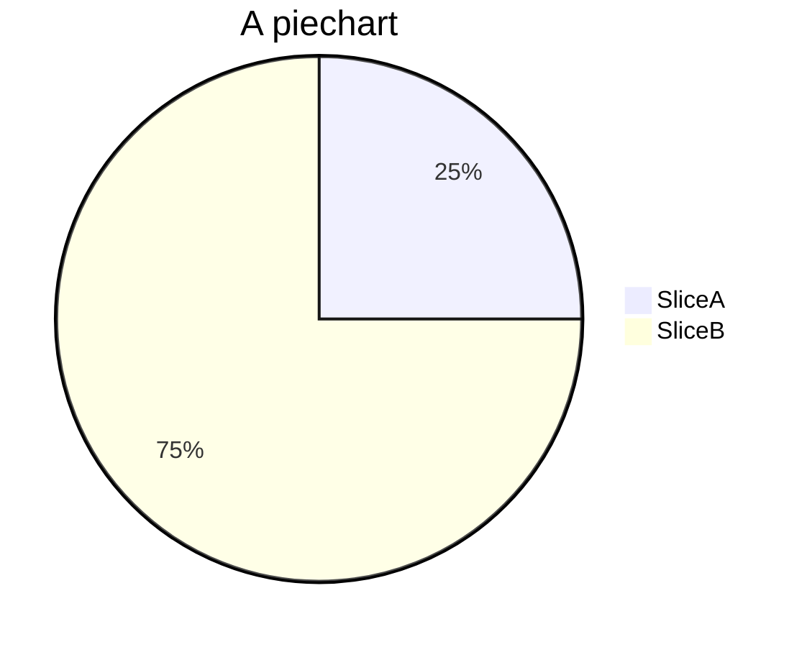
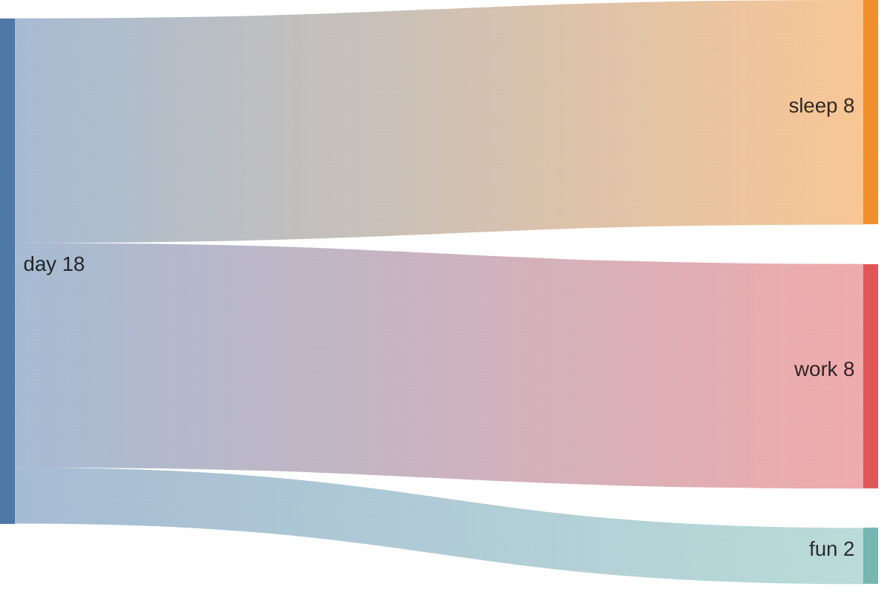

# Testing

First Term
: This is the definition of the first term.

Second Term
: This is one definition of the second term.
: This is another definition of the second term.

~~The world is flat.~~ We now know that the world is round.


This sentence uses `$` delimiters to show math inline: $\sqrt{3x-1}+(1+x)^2$

<mark>highlight</mark>

X<sup>2</sup>


``Use `code` in your Markdown file.``

H<sub>2</sub>0

I need to highlight these <mark>very important words</mark>.

## Callouts

{: .warning }
> A paragraph

{: .new }
> > A paragraph
> >
> > Another paragraph
> >
> > The last paragraph

{: .highlight-yellow }
Highlight yellow

{: .highlight-blue }
Highlight blue

{: .highlight-green }
Highlight green

{: .highlight-red }
Highlight red

{: .highlight-greylt }
Highlight greylt

{: .highlight }
Test 2

{: .note }
A paragraph

{: .important }
> A paragraph
>
> Another paragraph
>
> The last paragraph

{: .new-title }
> New title

{: .new-title }
> **"Why not simply use the `delay()` or `millis()` functions to accomplish this?"**


## Italicizing and Bolding

*Lorem ipsum*

**Lorem ipsum**

***lorem ipsum***

Gone camping! :tent: Be back soon.

That is so funny! :joy:

:smile:  
😀

## Tables
| head1        | head two          | three |
|:-------------|:------------------|:------|
| ok           | good swedish fish | nice  |
| out of stock | good and plenty   | nice  |
| ok           | good `oreos`      | hmm   |
| ok           | good `zoute` drop | yumm  |

## Code  blocks
This is `code`

``` c
const a = 10;
static var;
```

## Creating a Link
Relative link within the directories:  
[This is a link](software/modules/modules.html)  
External Link:
[Arduino Docs](https://docs.arduino.cc/)

## Images


> hey
> test
>> oh my
>>> sheesh

 The nodes for the library and modules are also interactive—click to explore specific software functionality and learn more about its design.

## Putting lines in between

hi

***

there

## Creating an ordered list of items
1. bananas
2. apples
3. durian

## Creating an unordered list of items
* bananas
* apples
* durian
    * cherries

## Tables

| Col 1 | Col 2 |
| -----  | :-----: |

- [ ] hello, this is a todo item
- [ ] hello, this is another todo item
- [x] goodbye, this item is done











> {: .new }
> > A paragraph
> >
> > Another paragraph
> >
> > The last paragraph

- Understanding how to communicate between the ADC122S021 and the ATMEGA328P using the SPI protocol for serial transfer of AC voltage data. 
<p align="center">
   <object data="../images/software_block_diagram.svg" type="image/svg+xml" width="750"></object>
</p>


### Configuring SPI Protocol

This section describes SPI pins and clock frequency configuration to ensure successful communication.

To set the CS, MOSI, and SCLK pins to their desired state, use the following command

```cpp
#include <SPI.h>
```


```cpp
SPI.beginTransaction(SPISettings(1500000, MSBFIRST, SPI_MODE0)); // Configure and start comms
```

## 🔢 PWM Timing Calculation (for 50Hz output)
$$f_{sw} = 31,372Hz$$
$$f_{sw} = \frac{1}{f_{sw}} = 31.875\mu s$$ 


## Inductor Selection

To determine the inductor current (input current draw):

$$I_{L(DC)} = \frac{V_{OUT} \times I_{OUT}}{V_{IN} \times \eta}$$

- $V_{OUT}$ = 12V
- $V_{IN}$ = 5V
- $\eta$ = 0.8 (80% recommended by datasheet)
- $I_{OUT}$ = ?

Need to find the load current that will be drawn. This boost converter is only driving the two IR2302 gate drivers for our PWM Inverter H-bridge design so if we find the current consumed by these drivers, we will effectively find the output load to drive. The current consumption of a gate driver is based upon the static and dynamic current consumption. As per the IR2302 datasheet, the max possible Quiescent Vcc supply current $I_{QCC}$ = 1.6mA. Therefore, $I_{static}$ = 1.6mA. The dynamic current consumed by the device can be found by the following relation between the total gate charge of the MOSFET and the switching frequency:

$I_{dynamic}​ = Q_{g} ​× f_{sw}$

As per the IRFB4020PBF MOSFET datasheet, the maximum total gate charge is 29nC and the switching frequency of operation of the gate drivers is 31,372Hz.
- $Q_{g} = 29nC$
- $f_{sw} = 31,372Hz$

Using these values, the dynamic current consumption of one MOSFET is:

$I_{dynamic}​ = 0.91mA$

Considering that the PWM inverter topology is based on 4 MOSFETs with only 2 operating at any given time simultaneously, this means the total dynamic current is $2 \times I_{dynamic}​ = 1.82mA$. Additionally, the quiescent current is dictated by two gate drivers so the total static current is $2 \times I_{static}​ = 3.2mA$.

$I_{LOAD}​ = I_{STATIC} ​+ I_{DYNAMIC}$<br>
$I_{OUT}​ = 5.02mA$

Now that we have the total load current $I_{OUT}$ = 5.02mA, then we can solve for the inductor current using the following values:

- $V_{OUT} = 12V$
- $V_{IN} = 5V$
- $I_{OUT} = 5.02mA$
- $\eta$ = 0.8 (80% recommended by datasheet)

$$I_{L(DC)} = 15.06mA$$

The inductor ripple current is calculated with Equation 3 for an asynchronous boost converter in continuous conduction mode (CCM).

$$\Delta I_{L(\text{P-P})} = \frac{V_{IN} \times (V_{OUT} + 0.8V - V_{IN})}{L \times f_{SW} \times (V_{OUT} + 0.8V)}$$

where:
- ΔIL(P-P) is inductor ripple current 
- L is inductor value 
- f SW is switching frequency 
- VOUT is output voltage 
- VIN is input voltage