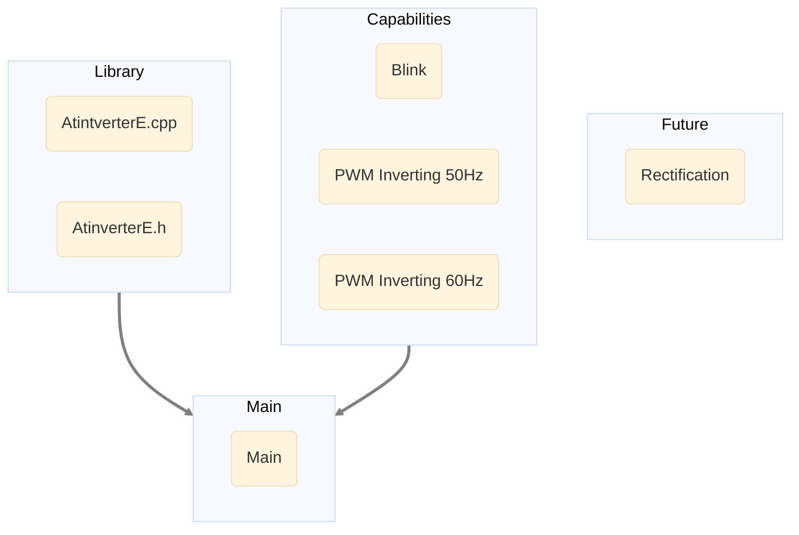

# **Software**
***

The Atinverter codebase is composed of various modules, each contributing to distinct functionalities. \
The following diagram showcases the available features of the Atinverter codebase. Each box in the \
diagram is interactive, allowing you to click and explore detailed information about specific features.

