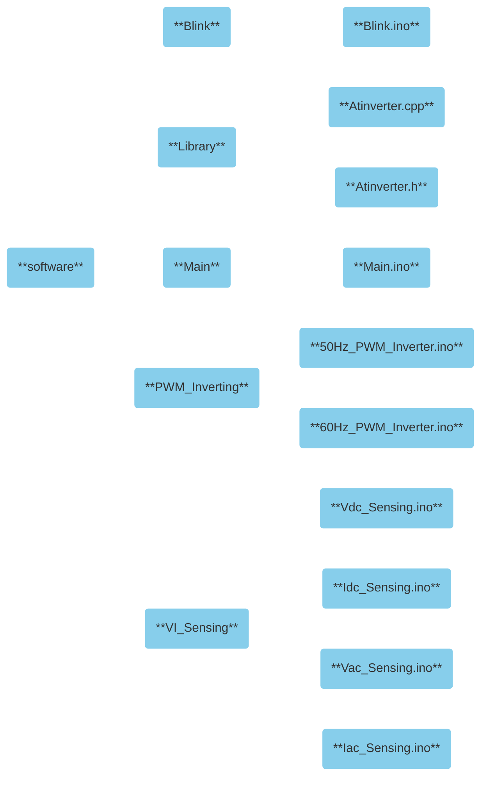

<!-- To enable math equation formatting -->

  <!-- Polyfill for older browsers (optional) -->
  

  <!-- MathJax v3 for LaTeX rendering -->
  

  <!-- Custom MathJax Configuration -->
  


# **Atinverter V2 Software**
***

The Atinverter V2 codebase is composed of a `Library` folder as well as well various module folders (`Blink`, `Main`, `PWM_Inverting`, and `VI_Sensing`). The Atinverter library contains the object-oriented coding framework that allows for intuitive intialization, control, and sensing of the Atinverter V2 hardware. The various ready-to-run and deployable modules serve the purpose of showcasing the different features of the hardware by incorporating and applying the Atinverter library. The following diagram provides a visual representation of the software hierarchy and the available `C++` and Arduino `.ino` files that the user can utilize to enable Atinverter V2 hardware operation.
 
 

    <h7><b>Figure X.</b> Atinverter V2 Software Modules and Files</h7>

