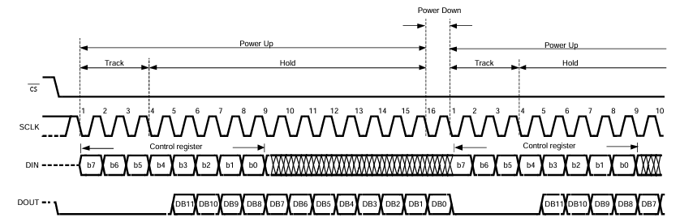
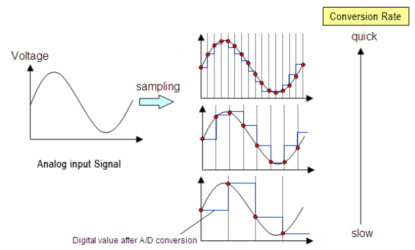

<!-- To enable math equation formatting -->

  <!-- Polyfill for older browsers (optional) -->
  <script type="text/javascript" async 
    src="https://polyfill.io/v3/polyfill.min.js?features=es6">
  </script>

  <!-- MathJax v3 for LaTeX rendering -->
  <script type="text/javascript" async 
    id="MathJax-script" 
    src="https://cdn.jsdelivr.net/npm/mathjax@3/es5/tex-mml-chtml.js">
  </script>

  <!-- Custom MathJax Configuration -->
  <script type="text/javascript">
    MathJax = {
      tex: {
        inlineMath: [['$', '$'], ['\\(', '\\)']],
        displayMath: [['$$', '$$'], ['\\[', '\\]']],
      }
    };
  </script>


# **AC V/I Sensing Library Feature**
---

## 📋 Overview  

The AC Voltage and Current Sensing feature enables real-time monitoring of the PWM inverter's output voltage and current. It leverages the ATMEGA328P's SPI peripheral to interface with the ADC122S021 which samples conditioned analog signals. This feature includes methods for configuring the SPI bus, acquiring ADC readings, correcting DC offset, computing RMS values, and setting the sensitivity factor that scales the AC RMS readings.

As mentioned in the [AC Voltage Sensing](../../../hardware/atinverter_v2/ac_volt_sensing_hw) hardware section, to achieve AC RMS voltage measurement across the load of the power inverter ($V_{\mathrm{AC_load}}$), the signal is:
1. Transformed from a 12V-48$V_{pk}$ AC signal to a composite signal containing both DC and AC components.
2. Scaled down to a 2.5V DC, 0-1V AC peak signal (effectively ranges from 1.5V to 3.5V), to maintain compatibility with the ADC122S021 input channels

Now that this signal is conditioned appropriately for sampling, the next step is properly configure the SPI bus on the ATMEGA328P to interface with the ADC122S021.
<br>
<br>

---

## 🔄 Outline of SPI Communication

The ATMEGA328P operates as the master/controller and the ADC122S021 as the slave/peripheral. As it is conventional in SPI communication, the ATMEGA328P initiates communication by setting **CS** low. The communication is conducted in 16 clock pulses of the **SCLK** frequency, corresponding to two byte data frames. 

Since SPI inherently is **full-duplex**, these two data frames are used for:
1. Sending control data through MOSI (**DIN of ADC122S021**) to specify the channel to read from 
2. Receiving conversion data through MISO (**DOUT of ADC122S021**)

It should be highlighted that the only useful data for **DIN** and **DOUT** are the first 8 most significant bits (MSB) and the last 12 least significant bits (LSB) respectively. 

The ADC122S021 uses a successive approximation register (SAR) topology with a track-and-hold mechanism. The voltage samples are tracked for the first 4 clock cycles and held for data transmission during the subsequent 12 clock cycles.

Once the 12-bit conversion data is received by the ATMEGA328P, the CS line is enabled high to terminate communication with the ADC122S021.

The timing diagram of the ADC122S021 provides an insightful visual representation of the SPI communication and reflects the information covered.



<br>

---

## ⌚ Choosing the Appropriate SPI Clock Source

Ensuring suitable communication with the ADC122S021 relies on providing a clock source from the ATMEGA328P that falls within the allowable frequency range of the device. The clock signal is critical as it maps to the sampling rate of the ADC122S021 which is also constrained to a specific range. The table below summarizes the ranges of allowable clock frequencies and their corresponding sample rates:

| Notation     | Parameter         | Range            |
|:------------:|:-----------------:|:----------------:|
| $f_{sclk}$   | Clock Frequency   | 0.8MHz - 3.2MHz  |
| $f_{s}$      | Sample Rate       | 50ksps - 200ksps |  

The relationship between the sample rate and the clock frequency can be understood from the following equation:

$$f_{s} = \frac{f_{SCLK}}{16}$$

This expression reflects the idea that a complete 12-bit signal conversion requires 16 clock pulses. As a result, the sampling frequency is one-sixteenth of the clock frequency.

The clock source delivered to the ADC122S021 is derived from the 16MHz main clock of the ATMEGA328P and a pre-scaler value of our choosing. The available pre-scalers are displayed below:

| Prescaler     | Arduino Command      | Resulting Frequency  |
|:-------------:|:--------------------:|:--------------------:|
| 2             | SPI_CLOCK_DIV2       | 8 MHz                |
| 4             | SPI_CLOCK_DIV4       | 4 MHz                |
| 8             | SPI_CLOCK_DIV8       | 2 MHz                |
| 16            | SPI_CLOCK_DIV16      | 1 MHz                |
| 32            | SPI_CLOCK_DIV32      | 500 kHz              |
| 64            | SPI_CLOCK_DIV64      | 250 kHz              |
| 128           | SPI_CLOCK_DIV128     | 125 kHz              |

Given that the clock signal is constrained to the range of 0.8MHz - 3.2MHz for the ADC122S021, this means we can choose to either to supply a 1MHz or 2MHz clock signal from the ATMEGA328P. Either option is in theoretically valid, but there are important tradeoffs to consider:

Choosing a higher sampling frequency (2MHz):
- Better resolution
- Improved signal to noise ratio (SNR)
- Spreading of ADC quantization noise over a broader bandwidth

Choosing a lower sampling frequency (1MHz):
- Reduced software overhead (fewer clock cycles)
- Less memory intensive for MCU
- More power efficient

The **Nyquist Sampling Theorem** states that to minimally reconstruct an analog signal without aliasing, the sampling frequency $f_{s}$ must be at least 2 times the maximum frequency component $f_{max}$ of the analog signal. This miminum requirement for the sampling rate is also known as the Nyquist Rate.

$$f_{s} \geq 2 \times f_{max}$$

Aliasing represents an adverse effect where the sampled waveform loses its charateristic shape and appears as a different frequency.

While just marginally satisfying the Nyquist Rate condition may be appropriate in some applications, this does not always guarentee proper resolution and amplitude accuracy of the signal.

In practical applications such as sampling sinusoidal signals, it is recommended that $f_{s}$ is at least 5 to 10 times the sinusoidal signal $f_{sinusoid}$. 

<p align="center">

</p>

Higher ADC sample rates yield finer resolution in the digitized sinusoidal waveform, whereas lower sampling raters result in a degraded signal in terms of resolution and signal shape.

In this design, the ADC122S021 is tasked with sampling the output voltage and current signals of PWM inverter, both of which are 50Hz or 60Hz sinusoidal signals depending on the PWM generation technique. Considering how these signals are far lower in frequency relative to the sampling capabilities of the ADC122S021, a clock rate of 1MHz (pre-scaler 16) was selected. This aims to reduce software overhead and memory load as well as maintain an adequate sampling rate for proper signal digitization.

$$f_{s} = \frac{1 \times 10^6Hz}{16} = 62.5kHz$$

$$\frac{f_{s}}{f_{max}} = \frac{62.5 \times 10^3Hz}{60Hz} ≈ 1042$$

The sampling frequeny is substantially larger than the recommended amount so a high fidelity signal is to be expected.

Translating this concept into software, the command below:

```cpp
SPI.beginTransaction(SPISettings(CLOCK_FREQUENCY, MSBFIRST, SPI_MODE0));
```

is used to specify key metrics of the SPI communication protocol. The `CLOCK_FREQUENCY` is a macro that maps to 1MHz. In addition, most significant bit (MSB) transmission and SPI Mode 0 (CPOL = 0, CPHA = 0) are specified with macros in accordance with ADC122S021 device requirements.
<br>

---

## 📌 Pin Assignments

The following table delineates the pins used for the SPI protocol and their desired states:

| Pin Type | Digital Pin Number    | State   |
|:--------:|:---------------------:|:-------:|
| CS       | 10                    | OUTPUT  |
| MOSI     | 11                    | OUTPUT  | 
| MISO     | 12                    | INPUT   | 
| SCLK     | 13                    | OUTPUT  |

Configuring all SPI pins on the ATMEGA328P can be performed by using `SPI.begin()` from the Arduino built-in `SPI.h` library. Since the `SPI.h` library is included in the user-defined header file `Atinverter.h`, no need to include it separately in the module program.

<br>

---

## 📂 Library Structure

**Implementation in `Atinverter.h`:**

```cpp
#include <SPI.h>

// TMCS1108 Current Sensor Parameters
#define SENSOR_GAIN_MV_PER_A 400.0f
#define MV_TO_V 1000.0f
#define VOUT_0A 2.5f

// ADC Parameters
#define VREF 5.0f
#define ADC_122S021_MAX_VALUE 4095.0f

// Parameters AC Sensing
uint32_t period;
float 	 sensitivity = DEFAULT_SENSITIVITY;

// AC Voltage and Current Pin Definitions
static const int VI_AC_CS_PIN = 10;
static const int VI_AC_MOSI_PIN = 11;
static const int VI_AC_MISO_PIN = 12;
static const int VI_AC_SCLK_PIN = 13;

// Methods
void setUpSPI();
void setSensitivity(float value);
int getADC(uint8_t control_byte);
int getZeroPoint(uint8_t control_byte);
float getRmsAC(uint8_t loopCount, bool isVac);
```
<br>

---

## 📝 Method Descriptions

## `void setUpSPI()`

**Purpose:** Initializes the SPI interface and configures the relevant pins.

**Pseudocode:**
1. Configure CS, MOSI, and SCLK pins to their desired state

**Implementation in `Atinverter.cpp`:**
```cpp
void Atinverter::setUpSPI() {
  SPI.begin();
}
```
<br>

## `int getZeroPoint(uint8_t control_byte)`

**Purpose:** Calculates the zero-point (DC offset) value of the ADC readings over a full sampling period. This value is used to remove the DC bias from the AC signal before performing RMS calculations.

**Parameters:**
- `control_byte` – ADC command byte: `0x00` selects channel 1; `0x08` selects channel 2

**Pseudocode:**
1. Initialize accumulators and timing
2. While the elapsed time is less than the period:
  - Read the ADC value from the specified control_byte channel
  - Accumulate the ADC value
  - Increment the measurement count
3. Return
  - Compute and return the average (sum divided by the count)

**Implementation in `Atinverter.cpp`:**
```cpp
int Atinverter::getZeroPoint(uint8_t control_byte) {
	uint32_t Vsum = 0;
	uint32_t measurements_count = 0;
	uint32_t t_start = this->millis2();

	while (this->millis2() - t_start < period)
	{
    Vsum += this->getADC(control_byte);
		measurements_count++;
	}

	return Vsum / measurements_count;
}
```
<br>

## `void setSensitivity(float value)`

**Purpose:** Sets the sensitivity factor used to scale RMS ADC values to real-world signal amplitude.

The sensitivity factor is applied in the `getRmsAC()` method after calculating the RMS value of the ADC samples. It ensures that the returned value reflects the actual physical signal magnitude, not just the ADC voltage level.

**Pseudocode:**
1. Take the user-defined sensitivity input.
2. Store it as the internal sensitivity scaling variable.

**Implementation in `Atinverter.cpp`:**
```cpp
void Atinverter::setSensitivity(float value) {
	sensitivity = value;
}
```
<br>

## `int getADC(uint8_t control_byte)`

**Purpose:** Initiates an SPI transaction with the ADC122S021 to retrieve a 12-bit digital conversion result from the specified input channel.

**Parameters:**
- `control_byte` – ADC command byte: `0x00` selects channel 1; `0x08` selects channel 2

**Pseudocode:**
1. Pull CS low and configure SPI parameters to begin SPI transmission
2. Conduct 1st byte transfer
  - Send control byte to specify channel
  - Receive 8 MSB conversion bits (only 4 LSB are significant)
3. Shift first 8 bits received by 8 bits to make that MSB data
4. Conduct a 2nd byte transfer
  - Send dummy byte (0x00)
  - Receive 8 LSB bits of conversion
5. Combine the 2 received bytes (MSB + LSB)
6. Mask the lower 12 bits to get valid ADC data
7. Pull CS high to end transaction
8. Return 12-bit ADC sample

**Implementation in `Atinverter.cpp`:**
```cpp
int Atinverter::getADC(uint8_t control_byte) {
  
  digitalWrite(VI_AC_CS_PIN, LOW);
  SPI.beginTransaction(SPISettings(CLOCK_FREQUENCY, MSBFIRST, SPI_MODE0));
  
  uint16_t data = SPI.transfer(control_byte);
  data <<= 8;
  
  data |= SPI.transfer(0x00);
  
  digitalWrite(VI_AC_CS_PIN, HIGH);
  SPI.endTransaction();

  data &= 0x0FFF;
  return data;
}
```
<br>

## `float getRmsAC(uint8_t loopCount, bool isVac)`

**Purpose:** Calculates the RMS value of either AC voltage or current over multiple user-defined sampling cycles. The value is offset-corrected using the zero-point and scaled using a sensitivity factor to reflect the actual signal amplitude.

**Parameters:**
- `loopCount` – number of sampling cycles to average over for increased accuracy
- `isVac` – `true` to measure AC voltage; `false` to measure AC current

**Pseudocode:**
1. Determine the ADC channel based on `isVac`
  - `true` to use voltage channel
  - `false`to use current channel
2. Iterate `loopCount` times:
  - Compute DC offset using `getZeroPoint()`
  - Initialize accumulators and timing
  - While elapsed time is less than the period:
    - Sample ADC
    - Remove DC offset and square the result
    - Accumulate the sum and measurement count
   - Compute RMS value using the root mean square formula: $X_{RMS} = \sqrt{\frac{1}{N} \sum x^2}$
   - Scale result using `sensitivity` to convert to physical units
3. Average all loop results and return the final RMS value

**Implementation in `Atinverter.cpp`:**
```cpp
float Atinverter::getRmsAC(uint8_t loopCount, bool isVac) {

  uint8_t control_byte;
  if (isVac){
    control_byte = VAC_ADC_CHANNEL;
  }
  else{
    control_byte = IAC_ADC_CHANNEL;
  }

	double readingVoltage = 0.0f;

	for (uint8_t i = 0; i < loopCount; i++)
	{
		int zeroPoint = this->getZeroPoint(control_byte);

		int32_t Vnow = 0;
		uint32_t Vsum = 0;
		uint32_t measurements_count = 0;
		uint32_t t_start = this->millis2();

		while (this->millis2() - t_start < period)
		{
			Vnow = this->getADC(control_byte) - zeroPoint;
			Vsum += (Vnow * Vnow);
			measurements_count++;
		}

		readingVoltage += sqrt(Vsum / measurements_count) / ADC_122S021_MAX_VALUE * VREF * sensitivity;
	}

	return readingVoltage / loopCount;
}
```


