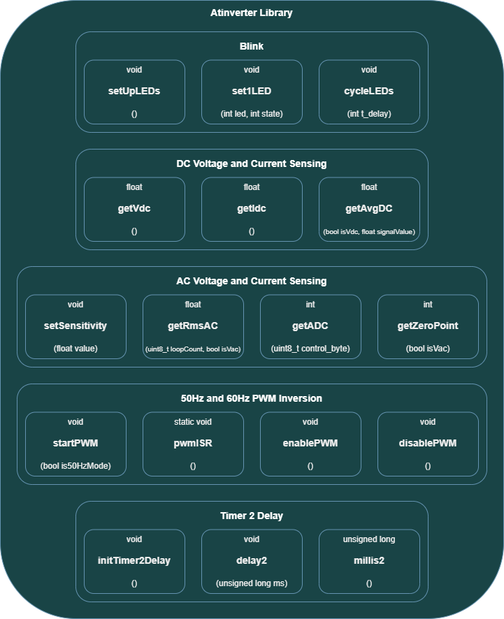

# **Atinverter V2 Library Reference**
***

The Atinverter library is comprised of two files: `Atinverter.h` and `Atinverter.cpp`. The header file serves as the blueprint containing the Atinverter class definition, along with its method declarations and member variables. The implementation for the Atinverter class and initilization of member variables are defined in `Atinverter.cpp`. At a high level, the Atinverter is essentially just two files as illustrated below:

Looking deeper into the Atinverter Library, it consists of 

