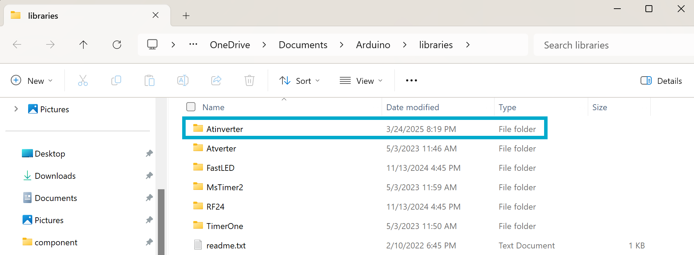

# **Atinverter Library Set Up**
### A guide to help your Arduino IDE recognize and use the Atinverter user-defined library
---

You might be thinking:

{: .highlight-yellow }
> 💭 “Okay, I downloaded the software files from the GitHub repository — now what? Can I just open some random file like `blink.ino` and run the code?”

You're almost there! There is just **one important step** that needs to happen first; We need ensure that the **Arduino IDE knows where to find the Atinverter library files** (`Atinverter.cpp`, `Atinverter.h`), or else you’ll run into the notorious:

{: .highlight-red }
> `fatal error: Atinverter.h: No such file or directory`

---

## 📁 How Arduino Handles Libraries

The Arduino IDE looks for **user-defined libraries** in a specific directory on your computer. Simply placing `.cpp` or `.h` files in the same directory as the `.ino` files you wish to run isn't enough.

Here's where those locations are:

🔍 If you're on Windows, it'll be in:

{: .highlight-greylt }
`C:\Users<YourUsername>\Documents\Arduino\libraries\`


🔍 If you're on macOS or Linux, it'll be in:

{: .highlight-greylt }
`~/Documents/Arduino/libraries/`

---

## ✅ What To Do

1. Navigate to the `Atinverter` library folder in the repository. It contains the source files `Atinverter.cpp`, `Atinverter.h`, and the metadata file `library.properties`. It is located in:

    {: .highlight-greylt }
    > `\AtInverter\software\Library`

2. Copy the `Atinverter` folder to your Arduino `libraries` folder as described in \
**How Arduino Handles Libraries**

📸 You should expect to see something like this in your Arduino `libraries` folder:



---

## 🚀 You're Good to Go

Once the Atinverter library is in the right place, you can use it any sketch with:
```cpp
#include "Atinverter.h"
```