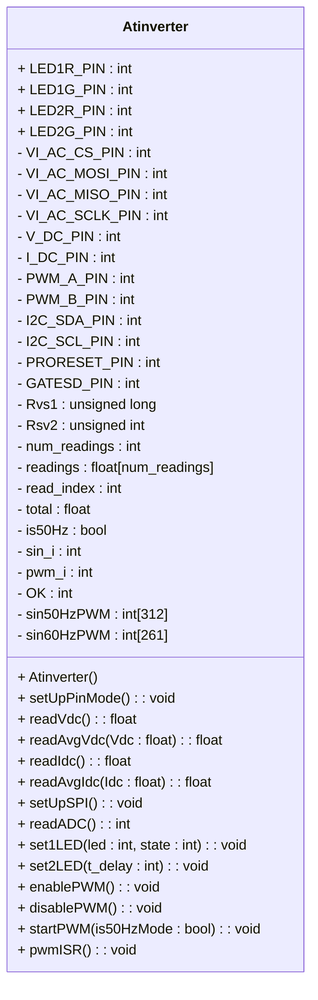

# **Atinverter UML Diagram**
***

```mermaid
classDiagram
  class Atinverter {
    + LED1R_PIN : int
    + LED1G_PIN : int
    + LED2R_PIN : int
    + LED2G_PIN : int

    - VI_AC_CS_PIN : int
    - VI_AC_MOSI_PIN : int
    - VI_AC_MISO_PIN : int
    - VI_AC_SCLK_PIN : int

    - V_DC_PIN : int
    - I_DC_PIN : int

    - PWM_A_PIN : int
    - PWM_B_PIN : int

    - I2C_SDA_PIN : int
    - I2C_SCL_PIN : int

    - PRORESET_PIN : int
    - GATESD_PIN : int

    - Rvs1 : unsigned long
    - Rsv2 : unsigned int

    - num_readings : int
    - readings : float[num_readings]
    - read_index : int
    - total : float

    - is50Hz : bool
    - sin_i : int
    - pwm_i : int
    - OK : int
    - sin50HzPWM : int[312]
    - sin60HzPWM : int[261]

    + Atinverter()

    + setUpPinMode() : void
    + readVdc() : float
    + readAvgVdc(Vdc : float) : float
    + readIdc() : float
    + readAvgIdc(Idc : float) : float
    + setUpSPI() : void
    + readADC() : int
    + set1LED(led : int, state : int) : void
    + set2LED(t_delay : int) : void
    + enablePWM() : void
    + disablePWM() : void
    + startPWM(is50HzMode : bool) : void
    + pwmISR() : void
  }
```

